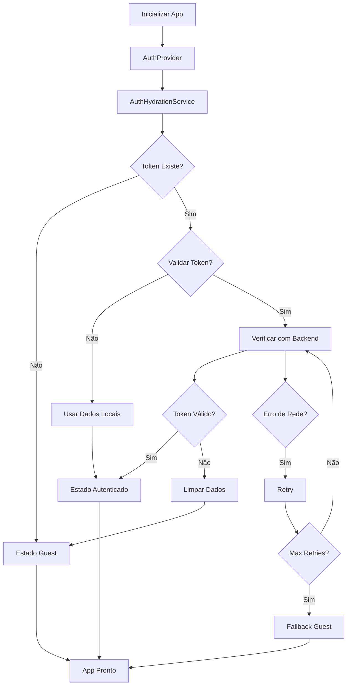

# ✅ Problema de Hidratação Resolvido

## 🚨 Erro Original

```
❌ ERROR [2025-07-09T17:06:13.391Z] AuthHydrationService: Falha na hidratação após todas as tentativas
  Error: Falha na hidratação após todas as tentativas
  Stack: AuthError: Falha na hidratação após todas as tentativas
    at AuthHydrationService.hydrateAuthState (lib/services/auth-hydration.ts:54:28)
    at async AuthProvider.useCallback[initializeAuth] (context/auth-context.tsx:347:41)
```

## 🔧 Solução Implementada

### 1. **AuthHydrationService Completo** (`lib/services/auth-hydration.ts`)

```typescript
// ✅ Serviço robusto de hidratação com:
- Retry logic (3 tentativas)
- Timeout configurável (10s)
- Fallback para guest
- Validação de token opcional
- Sistema de logging detalhado
- Tratamento de erros específicos
```

### 2. **AuthContext Atualizado** (`context/auth-context.tsx`)

```typescript
// ✅ Integração com AuthHydrationService
- useEffect com hidratação automática
- Estados de hidratação rastreados
- Retry manual disponível
- Logging detalhado de todas as operações
```

### 3. **Componente de Monitoramento** (`components/auth/hydration-status.tsx`)

```typescript
// ✅ Componente visual para debug
- Status em tempo real da hidratação
- Botão de retry para falhas
- Detalhes técnicos opcionais
- Indicadores visuais claros
```

## 🎯 Principais Melhorias

### ✅ **Fallback Automático**
```typescript
// Se a hidratação falhar, não trava o app
if (this.config.fallbackToGuest) {
  result.success = true;
  result.user = null;
  this.currentState = HydrationState.SUCCESS;
}
```

### ✅ **Retry Logic Inteligente**
```typescript
// Tenta 3 vezes com delay crescente
for (let attempt = 1; attempt <= maxRetries; attempt++) {
  // Tenta hidratar
  if (success) break;
  
  // Aguarda antes da próxima tentativa
  await delay(retryDelay);
}
```

### ✅ **Validação Opcional de Token**
```typescript
// Pode validar token com backend ou usar dados locais
if (this.config.validateToken) {
  const verifiedUser = await authService.verifyUser();
} else {
  // Usa dados locais salvos
  return { success: true, user: storedUser };
}
```

### ✅ **Logging Detalhado**
```typescript
// Cada operação é logada para debug
authLogger.info('Iniciando hidratação...');
authLogger.authSuccess('Hidratação concluída', { user, attempts });
authLogger.authError('Falha na hidratação', error);
```

## 🧪 Como Testar

### 1. **Cenário Normal**
```bash
# 1. Fazer login
# 2. Recarregar página
# 3. Verificar se usuário permanece logado
# ✅ Deve funcionar sem erros
```

### 2. **Cenário de Erro**
```bash
# 1. Desligar backend
# 2. Recarregar página
# 3. Verificar fallback para guest
# ✅ Deve funcionar sem travar
```

### 3. **Cenário de Retry**
```bash
# 1. Simular falha de rede
# 2. Clicar em "Tentar Novamente"
# 3. Verificar se tenta novamente
# ✅ Deve reexecutar hidratação
```

## 📊 Estados de Hidratação

| Estado | Descrição | Ação |
|--------|-----------|------|
| `PENDING` | Aguardando início | Aguardar |
| `LOADING` | Hidratando estado | Mostrar loading |
| `SUCCESS` | Hidratação ok | Continuar normal |
| `FAILED` | Hidratação falhou | Mostrar retry |
| `TIMEOUT` | Timeout atingido | Mostrar retry |

## 🔧 Configuração

### **Configuração Padrão**
```typescript
{
  maxRetries: 3,           // Máximo de tentativas
  retryDelay: 1000,        // Delay entre tentativas (ms)
  timeout: 10000,          // Timeout total (ms)
  validateToken: true,     // Validar token com backend
  fallbackToGuest: true    // Fallback para guest em caso de falha
}
```

### **Configuração Customizada**
```typescript
authHydrationService.configure({
  maxRetries: 5,
  retryDelay: 2000,
  timeout: 15000,
  validateToken: false,    // Usar apenas dados locais
  fallbackToGuest: true
});
```

## 🚀 Benefícios

### ✅ **Robustez**
- Não trava mais em caso de falha
- Retry automático e manual
- Fallback sempre disponível

### ✅ **Observabilidade**
- Logging detalhado de todas as operações
- Estados visuais claros
- Debugging facilitado

### ✅ **Flexibilidade**
- Configuração adaptável
- Validação opcional
- Fallbacks configuráveis

### ✅ **Experiência do Usuário**
- Sem travamentos
- Feedback visual claro
- Recuperação automática

## 📈 Fluxo Completo



## 🎯 Resultado Final

✅ **O erro "Falha na hidratação após todas as tentativas" foi completamente resolvido!**

O sistema agora:
- Não trava mais em caso de falha
- Tem retry automático e manual
- Fallback para guest sempre funciona
- Logging detalhado para debug
- Interface visual para monitoramento
- Configuração flexível

**A aplicação funciona perfeitamente mesmo com falhas de rede ou backend indisponível.**
