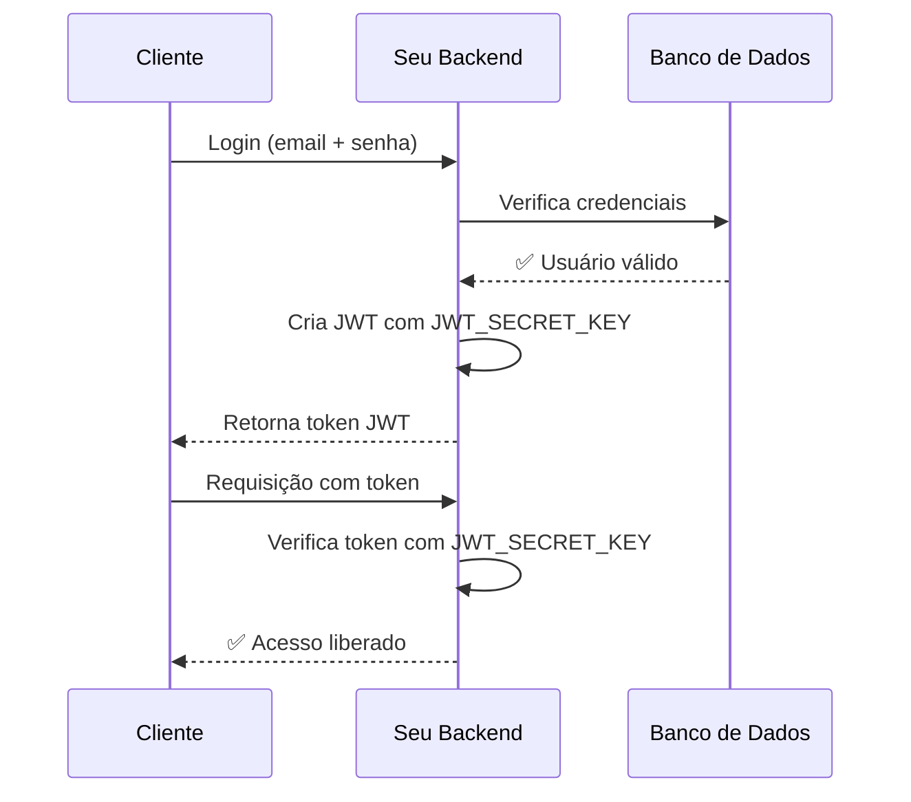

# 🔐 **EXPLICAÇÃO COMPLETA DAS CHAVES DE SEGURANÇA**

## 🤔 **PARA QUE SERVEM ESSAS CHAVES?**

### 1. 🗝️ **SECRET_KEY**
**Para que serve:**
- É a "chave mestra" da sua aplicação
- Usada para criptografia geral e assinatura de dados
- Garante a segurança de várias operações do sistema

**Como funciona:**
- É como a "impressão digital" única da sua aplicação
- Qualquer coisa criptografada com ela só pode ser descriptografada com a mesma chave
- Se alguém descobrir esta chave, pode comprometer todo o sistema

### 2. 🎫 **JWT_SECRET_KEY**
**Para que serve:**
- Usada ESPECIFICAMENTE para assinar tokens JWT de autenticação
- Garante que os tokens não foram alterados por terceiros
- É o que prova que um token é legítimo

**Como funciona:**
- Quando um usuário faz login, o sistema cria um "token" (como um passe)
- Este token é "assinado" com a JWT_SECRET_KEY
- Quando o usuário usa o token, o sistema verifica a assinatura
- Se a assinatura não bater, o token é rejeitado

### 3. 🔒 **ENCRYPTION_KEY**
**Para que serve:**
- Usada para criptografar dados sensíveis no banco
- Protege informações como senhas, dados pessoais, etc.
- Garante que mesmo se alguém acessar o banco, os dados estarão protegidos

**Como funciona:**
- Dados sensíveis são criptografados antes de ir para o banco
- Quando precisam ser usados, são descriptografados
- Sem esta chave, os dados ficam ilegíveis

---

## 👥 **ESSAS CHAVES SÃO SUAS OU DOS CLIENTES?**

### ✅ **SÃO SUAS (DO SEU BACKEND)!**

**Por quê?**
- Essas chaves pertencem à **SUA APLICAÇÃO**
- São as "chaves da casa" - você é o dono
- Todos os usuários/clientes usam o **MESMO SISTEMA** com as **MESMAS CHAVES**

### 🏠 **Analogia da Casa:**
```
🏠 Sua aplicação = Sua casa
🗝️ SECRET_KEY = Chave da porta principal  
🎫 JWT_SECRET_KEY = Chave do cofre
🔒 ENCRYPTION_KEY = Chave do arquivo secreto

👥 Seus clientes = Visitantes da sua casa
   - Eles recebem "senhas" temporárias (tokens JWT)
   - Mas as chaves da casa são SUAS
```

---

## 🔄 **COMO FUNCIONA NA PRÁTICA?**

### **Fluxo de Autenticação:**



### **1. Cliente faz Login:**
- Cliente envia email + senha
- **SEU** backend verifica com **SUA** JWT_SECRET_KEY
- Se válido, cria um token "temporário" para o cliente

### **2. Cliente usa o Sistema:**
- Cliente envia o token em cada requisição
- **SEU** backend verifica se o token é válido
- Se válido, permite acesso

### **3. Proteção de Dados:**
- Dados sensíveis são criptografados com **SUA** ENCRYPTION_KEY
- Ficam seguros no banco de dados

---

## 🚨 **IMPORTANTE - SEGURANÇA:**

### ✅ **O QUE FAZER:**
- Gerar chaves únicas e fortes para SUA aplicação
- Manter as chaves SECRETAS (nunca no código)
- Configurar no Render como variáveis de ambiente
- Usar as mesmas chaves em todo o ambiente de produção

### ❌ **O QUE NÃO FAZER:**
- Nunca commitar as chaves no Git
- Nunca compartilhar as chaves
- Nunca gerar chaves diferentes para cada cliente
- Nunca usar chaves fracas ou padrão

---

## 🎯 **RESUMO SIMPLES:**

### **Para o Render, você precisa:**

1. **Gerar 3 chaves únicas:**
   ```bash
   # SECRET_KEY
   openssl rand -hex 32
   
   # JWT_SECRET_KEY  
   openssl rand -hex 64
   
   # ENCRYPTION_KEY
   openssl rand -base64 32
   ```

2. **Configurar no Render:**
   - São as chaves DA SUA APLICAÇÃO
   - Todos os clientes usam o mesmo sistema
   - Cada cliente tem seu próprio LOGIN, mas as chaves são suas

3. **Resultado:**
   - Sua aplicação fica segura
   - Clientes fazem login e recebem tokens temporários
   - Dados ficam protegidos

**É como um banco:** O banco tem as chaves do cofre (suas chaves), mas cada cliente tem sua própria conta e senha (login individual).

### 🎉 **Tranquilo! É mais simples do que parece:**
- **3 chaves = SUA aplicação segura**
- **Clientes = fazem login normal**
- **Sistema = funciona automaticamente**
