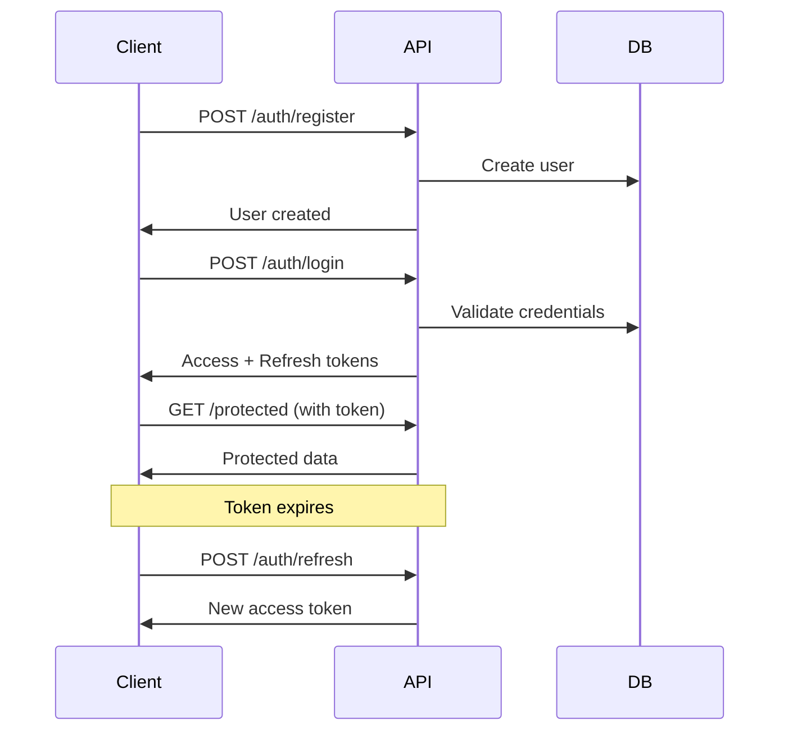

# 🚀 Guia Completo da API - SynapScale Backend

## 📋 Visão Geral

A API do SynapScale Backend fornece endpoints RESTful completos para gerenciar workflows, agentes de IA, autenticação, arquivos e muito mais. Todas as operações são documentadas interativamente e seguem os padrões REST.

## 🔗 URLs da Documentação

- **Swagger UI**: http://localhost:8000/docs
- **ReDoc**: http://localhost:8000/redoc  
- **OpenAPI JSON**: http://localhost:8000/openapi.json

## 🔐 Autenticação

### Sistema JWT

A API usa autenticação JWT (JSON Web Tokens) com refresh tokens para segurança máxima.

```bash
# Estrutura do token
Authorization: Bearer <jwt_token>
```

### Fluxo de Autenticação



## 📚 Endpoints por Categoria

### 🔑 **API Keys de Usuário (`/api/v1/user-variables/api-keys`)**

> **Novo em v1.1.0**: Sistema de API Keys específicas por usuário para provedores LLM

O sistema permite que usuários configurem suas próprias API keys para provedores LLM, oferecendo:
- ✅ **Controle individual** sobre custos e limites
- ✅ **Fallback automático** para chaves globais do sistema
- ✅ **Criptografia segura** com Fernet
- ✅ **Integração transparente** com todos os endpoints LLM

#### Configurar API Key

```http
POST /api/v1/user-variables/api-keys/{provider}
Authorization: Bearer <access_token>
Content-Type: application/json

{
  "value": "sk-proj-1234567890abcdef",
  "description": "Minha chave OpenAI pessoal"
}
```

**Provedores suportados**: `openai`, `anthropic`, `google`, `grok`, `deepseek`, `llama`

#### Listar API Keys (Mascaradas)

```http
GET /api/v1/user-variables/api-keys
Authorization: Bearer <access_token>
```

#### Remover API Key

```http
DELETE /api/v1/user-variables/api-keys/{provider}
Authorization: Bearer <access_token>
```

#### Listar Provedores Suportados

```http
GET /api/v1/user-variables/api-keys/providers
```

> 📚 **Documentação Completa**: [Guia de API Keys](./user_variables_api_keys_guide.md)

### 🔐 **Autenticação (`/api/v1/auth`)**

#### Registro de Usuário

```http
POST /api/v1/auth/register
Content-Type: application/json

{
  "email": "usuario@exemplo.com",
  "password": "senha123",
  "name": "Nome do Usuário",
  "phone": "+5511999999999",
  "company": "Empresa LTDA"
}
```

**Resposta:**
```json
{
  "message": "User registered successfully",
  "user": {
    "id": "123e4567-e89b-12d3-a456-426614174000",
    "email": "usuario@exemplo.com",
    "name": "Nome do Usuário",
    "is_active": true,
    "is_verified": false,
    "created_at": "2024-01-15T10:30:00Z"
  }
}
```

#### Login

```http
POST /api/v1/auth/login
Content-Type: application/json

{
  "email": "usuario@exemplo.com",
  "password": "senha123"
}
```

**Resposta:**
```json
{
  "access_token": "eyJhbGciOiJIUzI1NiIsInR5cCI6IkpXVCJ9...",
  "refresh_token": "eyJhbGciOiJIUzI1NiIsInR5cCI6IkpXVCJ9...",
  "token_type": "bearer",
  "expires_in": 1800,
  "user": {
    "id": "123e4567-e89b-12d3-a456-426614174000",
    "email": "usuario@exemplo.com",
    "name": "Nome do Usuário"
  }
}
```

#### Refresh Token

```http
POST /api/v1/auth/refresh
Authorization: Bearer <refresh_token>
```

#### Perfil do Usuário

```http
GET /api/v1/auth/me
Authorization: Bearer <access_token>
```

#### Verificação de Email

```http
POST /api/v1/auth/verify-email
Content-Type: application/json

{
  "token": "verification_token_from_email"
}
```

#### Reset de Senha

```http
POST /api/v1/auth/forgot-password
Content-Type: application/json

{
  "email": "usuario@exemplo.com"
}
```

```http
POST /api/v1/auth/reset-password
Content-Type: application/json

{
  "token": "reset_token_from_email",
  "new_password": "nova_senha123"
}
```

### ⚡ **Workflows (`/api/v1/workflows`)**

#### Listar Workflows

```http
GET /api/v1/workflows?page=1&size=10&search=automacao
Authorization: Bearer <access_token>
```

**Resposta:**
```json
{
  "items": [
    {
      "id": "workflow-123",
      "name": "Automação de Email",
      "description": "Workflow para automação de campanhas de email",
      "status": "active",
      "created_at": "2024-01-15T10:30:00Z",
      "updated_at": "2024-01-15T10:30:00Z",
      "nodes_count": 5,
      "executions_count": 42,
      "is_template": false,
      "tags": ["email", "marketing", "automacao"]
    }
  ],
  "total": 25,
  "page": 1,
  "size": 10,
  "pages": 3
}
```

#### Criar Workflow

```http
POST /api/v1/workflows
Authorization: Bearer <access_token>
Content-Type: application/json

{
  "name": "Novo Workflow",
  "description": "Descrição do workflow",
  "is_active": true,
  "nodes": [
    {
      "id": "node-1",
      "type": "trigger",
      "name": "Webhook Trigger",
      "position": {"x": 100, "y": 100},
      "config": {
        "method": "POST",
        "path": "/webhook"
      }
    },
    {
      "id": "node-2", 
      "type": "ai",
      "name": "Processar com IA",
      "position": {"x": 300, "y": 100},
      "config": {
        "provider": "openai",
        "model": "gpt-4o",
        "prompt": "Analise o texto: {{input}}"
      }
    }
  ],
  "connections": [
    {
      "source": "node-1",
      "target": "node-2",
      "source_handle": "output",
      "target_handle": "input"
    }
  ],
  "tags": ["novo", "teste"]
}
```

#### Obter Workflow

```http
GET /api/v1/workflows/{workflow_id}
Authorization: Bearer <access_token>
```

#### Atualizar Workflow

```http
PUT /api/v1/workflows/{workflow_id}
Authorization: Bearer <access_token>
Content-Type: application/json

{
  "name": "Workflow Atualizado",
  "description": "Nova descrição",
  "is_active": false
}
```

#### Executar Workflow

```http
POST /api/v1/workflows/{workflow_id}/execute
Authorization: Bearer <access_token>
Content-Type: application/json

{
  "input_data": {
    "texto": "Texto para processar",
    "parametro": "valor"
  },
  "webhook_url": "https://meusite.com/callback",
  "priority": "high"
}
```

**Resposta:**
```json
{
  "execution_id": "exec-456",
  "status": "running",
  "workflow_id": "workflow-123",
  "started_at": "2024-01-15T10:30:00Z",
  "input_data": {
    "texto": "Texto para processar"
  }
}
```

#### Obter Status da Execução

```http
GET /api/v1/workflows/executions/{execution_id}
Authorization: Bearer <access_token>
```

### 🤖 **Agentes IA (`/api/v1/agents`)**

#### Listar Agentes

```http
GET /api/v1/agents?category=assistant&provider=openai
Authorization: Bearer <access_token>
```

#### Criar Agente

```http
POST /api/v1/agents
Authorization: Bearer <access_token>
Content-Type: application/json

{
  "name": "Assistente de Vendas",
  "description": "Agente especializado em vendas e atendimento",
  "provider": "openai",
  "model": "gpt-4o",
  "system_prompt": "Você é um assistente de vendas experiente...",
  "temperature": 0.7,
  "max_tokens": 2000,
  "is_public": false,
  "capabilities": ["chat", "analysis", "recommendations"],
  "category": "sales",
  "knowledge_base": [
    {
      "type": "document",
      "content": "Manual de vendas da empresa..."
    }
  ]
}
```

#### Chat com Agente

```http
POST /api/v1/agents/{agent_id}/chat
Authorization: Bearer <access_token>
Content-Type: application/json

{
  "message": "Como posso melhorar minhas vendas?",
  "conversation_id": "conv-789",
  "context": {
    "user_role": "vendedor",
    "department": "comercial"
  },
  "stream": false
}
```

**Resposta:**
```json
{
  "message": "Para melhorar suas vendas, recomendo...",
  "conversation_id": "conv-789",
  "message_id": "msg-101",
  "tokens_used": 150,
  "provider": "openai",
  "model": "gpt-4o",
  "timestamp": "2024-01-15T10:30:00Z"
}
```

#### Chat com Streaming

```http
POST /api/v1/agents/{agent_id}/chat
Authorization: Bearer <access_token>
Content-Type: application/json

{
  "message": "Explique estratégias de vendas",
  "stream": true
}
```

**Resposta (Server-Sent Events):**
```
data: {"type": "start", "conversation_id": "conv-789"}

data: {"type": "token", "content": "Para"}

data: {"type": "token", "content": " melhorar"}

data: {"type": "end", "message_id": "msg-102", "tokens_used": 200}
```

### 📁 **Gerenciamento de Arquivos (`/api/v1/files`)**

#### Upload de Arquivo

```http
POST /api/v1/files/upload
Authorization: Bearer <access_token>
Content-Type: multipart/form-data

file: <arquivo.pdf>
purpose: "document_processing"
public: false
tags: ["documento", "importante"]
```

**Resposta:**
```json
{
  "id": "file-789",
  "filename": "documento.pdf",
  "original_name": "Relatório Mensal.pdf",
  "size": 2048576,
  "mime_type": "application/pdf",
  "url": "/api/v1/files/file-789",
  "public_url": null,
  "purpose": "document_processing",
  "tags": ["documento", "importante"],
  "uploaded_at": "2024-01-15T10:30:00Z",
  "processed": false
}
```

#### Listar Arquivos

```http
GET /api/v1/files?purpose=document_processing&page=1&size=20
Authorization: Bearer <access_token>
```

#### Download de Arquivo

```http
GET /api/v1/files/{file_id}
Authorization: Bearer <access_token>
```

#### Processar Arquivo

```http
POST /api/v1/files/{file_id}/process
Authorization: Bearer <access_token>
Content-Type: application/json

{
  "processor": "pdf_text_extraction",
  "options": {
    "extract_images": true,
    "split_pages": false
  }
}
```

### 🏪 **Marketplace (`/api/v1/marketplace`)**

#### Listar Templates

```http
GET /api/v1/marketplace/templates?category=automation&featured=true
Authorization: Bearer <access_token>
```

#### Obter Template

```http
GET /api/v1/marketplace/templates/{template_id}
Authorization: Bearer <access_token>
```

#### Instalar Template

```http
POST /api/v1/marketplace/templates/{template_id}/install
Authorization: Bearer <access_token>
Content-Type: application/json

{
  "workspace_id": "workspace-123",
  "customize": {
    "name": "Meu Workflow Personalizado"
  }
}
```

### 📊 **Analytics (`/api/v1/analytics`)**

#### Dashboard Principal

```http
GET /api/v1/analytics/dashboard
Authorization: Bearer <access_token>
```

**Resposta:**
```json
{
  "summary": {
    "total_workflows": 25,
    "total_executions": 1250,
    "success_rate": 0.95,
    "total_ai_calls": 500
  },
  "recent_executions": [...],
  "performance_metrics": {
    "avg_execution_time": 2.5,
    "peak_usage_hour": 14,
    "most_used_nodes": ["ai", "webhook", "email"]
  },
  "usage_by_period": {
    "daily": [...],
    "weekly": [...],
    "monthly": [...]
  }
}
```

#### Métricas Detalhadas

```http
GET /api/v1/analytics/metrics?start_date=2024-01-01&end_date=2024-01-31
Authorization: Bearer <access_token>
```

### 🏢 **Workspaces (`/api/v1/workspaces`)**

#### Criar Workspace

```http
POST /api/v1/workspaces
Authorization: Bearer <access_token>
Content-Type: application/json

{
  "name": "Equipe de Marketing",
  "description": "Workspace para automações de marketing",
  "settings": {
    "default_ai_provider": "openai",
    "max_executions_per_hour": 100
  }
}
```

#### Convidar Membro

```http
POST /api/v1/workspaces/{workspace_id}/members
Authorization: Bearer <access_token>
Content-Type: application/json

{
  "email": "novo.membro@empresa.com",
  "role": "editor",
  "permissions": ["read", "write", "execute"]
}
```

### 💬 **Conversas (`/api/v1/conversations`)**

#### Listar Conversas

```http
GET /api/v1/conversations?agent_id=agent-123&page=1
Authorization: Bearer <access_token>
```

#### Obter Histórico

```http
GET /api/v1/conversations/{conversation_id}/messages
Authorization: Bearer <access_token>
```

## 🔌 WebSockets

### Conexão WebSocket

```javascript
const ws = new WebSocket('ws://localhost:8000/api/v1/ws');

// Autenticação
ws.onopen = function() {
    ws.send(JSON.stringify({
        type: 'auth',
        token: 'your_jwt_token'
    }));
};

// Receber mensagens
ws.onmessage = function(event) {
    const data = JSON.parse(event.data);
    console.log('Received:', data);
};
```

### Tipos de Eventos

```json
// Execução de workflow iniciada
{
  "type": "workflow_execution_started",
  "execution_id": "exec-456",
  "workflow_id": "workflow-123"
}

// Progresso da execução
{
  "type": "workflow_execution_progress", 
  "execution_id": "exec-456",
  "node_id": "node-2",
  "status": "completed",
  "output": {...}
}

// Execução finalizada
{
  "type": "workflow_execution_completed",
  "execution_id": "exec-456",
  "status": "success",
  "result": {...}
}

// Mensagem de chat
{
  "type": "chat_message",
  "conversation_id": "conv-789",
  "message": "Resposta do agente...",
  "agent_id": "agent-123"
}
```

## ⚠️ Códigos de Status HTTP

| Código | Significado | Descrição |
|--------|------------|-----------|
| `200` | OK | Requisição bem-sucedida |
| `201` | Created | Recurso criado com sucesso |
| `400` | Bad Request | Dados inválidos na requisição |
| `401` | Unauthorized | Token inválido ou ausente |
| `403` | Forbidden | Sem permissão para o recurso |
| `404` | Not Found | Recurso não encontrado |
| `422` | Unprocessable Entity | Erro de validação |
| `429` | Too Many Requests | Rate limit excedido |
| `500` | Internal Server Error | Erro interno do servidor |

## 🔄 Rate Limiting

A API implementa rate limiting para proteção:

```http
X-RateLimit-Limit: 60
X-RateLimit-Remaining: 59
X-RateLimit-Reset: 1642234567
```

### Limites Padrão

- **Requisições gerais**: 60 por minuto
- **IA/Chat**: 10 por minuto  
- **Upload**: 5 por minuto
- **Execução**: 30 por hora

## 📝 Exemplos de Uso Completos

### Exemplo 1: Criando um Workflow Completo

```bash
#!/bin/bash

# 1. Fazer login
TOKEN=$(curl -s -X POST "http://localhost:8000/api/v1/auth/login" \
  -H "Content-Type: application/json" \
  -d '{"email": "user@example.com", "password": "password"}' \
  | jq -r '.access_token')

# 2. Criar workflow
WORKFLOW_ID=$(curl -s -X POST "http://localhost:8000/api/v1/workflows" \
  -H "Authorization: Bearer $TOKEN" \
  -H "Content-Type: application/json" \
  -d '{
    "name": "Análise de Sentimento",
    "description": "Analisa sentimento de textos",
    "nodes": [
      {
        "id": "input",
        "type": "input",
        "config": {"field": "texto"}
      },
      {
        "id": "ai",
        "type": "ai", 
        "config": {
          "provider": "openai",
          "prompt": "Analise o sentimento do texto: {{input}}"
        }
      }
    ],
    "connections": [
      {"source": "input", "target": "ai"}
    ]
  }' | jq -r '.id')

# 3. Executar workflow
curl -X POST "http://localhost:8000/api/v1/workflows/$WORKFLOW_ID/execute" \
  -H "Authorization: Bearer $TOKEN" \
  -H "Content-Type: application/json" \
  -d '{"input_data": {"texto": "Estou muito feliz hoje!"}}'
```

### Exemplo 2: Chat com Agente IA

```python
import requests
import json

# Configuração
BASE_URL = "http://localhost:8000/api/v1"
TOKEN = "your_jwt_token"

headers = {
    "Authorization": f"Bearer {TOKEN}",
    "Content-Type": "application/json"
}

# Criar agente
agent_data = {
    "name": "Assistente Python",
    "provider": "openai",
    "model": "gpt-4o",
    "system_prompt": "Você é um especialista em Python."
}

response = requests.post(f"{BASE_URL}/agents", 
                        headers=headers, 
                        json=agent_data)
agent_id = response.json()["id"]

# Chat com agente
chat_data = {
    "message": "Como criar uma API com FastAPI?",
    "stream": False
}

response = requests.post(f"{BASE_URL}/agents/{agent_id}/chat",
                        headers=headers,
                        json=chat_data)

print(response.json()["message"])
```

### Exemplo 3: Upload e Processamento de Arquivo

```python
import requests

# Upload
files = {'file': open('documento.pdf', 'rb')}
data = {
    'purpose': 'document_processing',
    'tags': '["documento", "pdf"]'
}

response = requests.post(f"{BASE_URL}/files/upload",
                        headers={"Authorization": f"Bearer {TOKEN}"},
                        files=files,
                        data=data)

file_id = response.json()["id"]

# Processar arquivo
process_data = {
    "processor": "pdf_text_extraction",
    "options": {"extract_images": True}
}

requests.post(f"{BASE_URL}/files/{file_id}/process",
              headers=headers,
              json=process_data)
```

## 🛠️ SDKs e Bibliotecas

### Python SDK (Exemplo)

```python
from synapscale import SynapScaleClient

# Inicializar cliente
client = SynapScaleClient(
    api_key="your_api_key",
    base_url="http://localhost:8000"
)

# Criar workflow
workflow = client.workflows.create(
    name="Meu Workflow",
    nodes=[...],
    connections=[...]
)

# Executar
execution = workflow.execute({"input": "dados"})

# Aguardar resultado
result = execution.wait_for_completion()
```

### JavaScript SDK (Exemplo)

```javascript
import { SynapScaleClient } from '@synapscale/sdk';

const client = new SynapScaleClient({
    apiKey: 'your_api_key',
    baseUrl: 'http://localhost:8000'
});

// Criar agente
const agent = await client.agents.create({
    name: 'Meu Agente',
    provider: 'openai'
});

// Chat
const response = await agent.chat('Olá, como você pode me ajudar?');
console.log(response.message);
```

## 🔒 Segurança

### Headers de Segurança

A API inclui automaticamente headers de segurança:

```http
X-Content-Type-Options: nosniff
X-Frame-Options: DENY
X-XSS-Protection: 1; mode=block
Strict-Transport-Security: max-age=31536000; includeSubDomains
```

### Validação de Entrada

Todos os endpoints validam rigorosamente os dados de entrada usando Pydantic.

### Rate Limiting

Implementado em múltiplas camadas para prevenir abuso.

## 📚 Recursos Adicionais

- **Postman Collection**: [Download](./postman/SynapScale-API.json)
- **Insomnia Workspace**: [Download](./insomnia/workspace.json)
- **OpenAPI Spec**: http://localhost:8000/openapi.json
- **Documentação Interativa**: http://localhost:8000/docs

## 🆘 Suporte

Para dúvidas sobre a API:

- 📖 **Documentação**: http://localhost:8000/docs
- 🐛 **Issues**: [GitHub Issues](https://github.com/synapscale/synapse-backend-agents-jc/issues)
- 💬 **Discord**: [Comunidade SynapScale](https://discord.gg/synapscale)
- 📧 **Email**: api-support@synapscale.com

---

✅ **API completa e bem documentada para máxima produtividade!** 