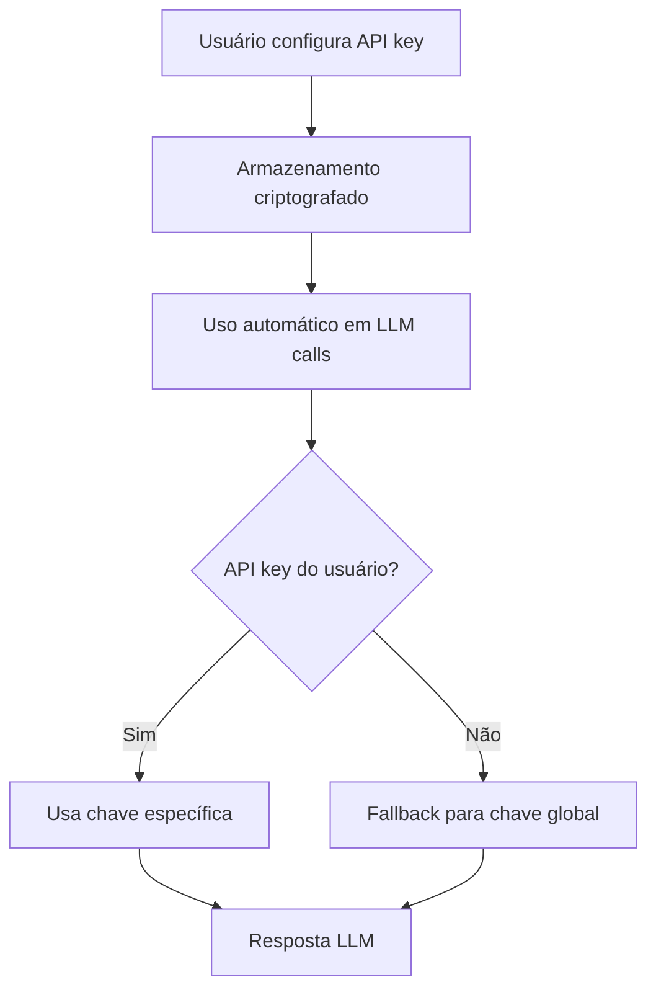

# 🔑 Guia de API Keys de Usuário - User Variables

## 📋 Visão Geral

O sistema de API Keys específicas por usuário permite que cada usuário configure suas próprias chaves de API para provedores LLM, oferecendo maior flexibilidade e controle sobre o uso de recursos de IA.

## 🏗️ Arquitetura

### Integração com user_variables

As API keys são armazenadas na tabela `user_variables` existente com:
- **Categoria**: `"api_keys"` para identificação
- **Criptografia**: Valores automaticamente criptografados com Fernet
- **Organização**: Chaves mapeadas por provedor (ex: `OPENAI_API_KEY`)

### Fluxo de Funcionamento



## 🔗 Endpoints Disponíveis

### 1. Configurar API Key

**Endpoint**: `POST /api/v1/user-variables/api-keys/{provider}`

**Descrição**: Configura uma API key específica do usuário para um provedor LLM.

**Parâmetros de URL**:
- `provider` (string): Nome do provedor (`openai`, `anthropic`, `google`, `grok`, `deepseek`, `llama`)

**Corpo da Requisição**:
```json
{
  "value": "sk-1234567890abcdef",
  "description": "Minha chave OpenAI pessoal"
}
```

**Exemplo de Requisição**:
```bash
curl -X POST "http://localhost:8000/api/v1/user-variables/api-keys/openai" \
  -H "Authorization: Bearer <access_token>" \
  -H "Content-Type: application/json" \
  -d '{
    "value": "sk-proj-1234567890abcdef",
    "description": "Chave OpenAI para projetos pessoais"
  }'
```

**Resposta de Sucesso** (201):
```json
{
  "message": "API key openai configurada com sucesso",
  "provider": "openai",
  "status": "success"
}
```

### 2. Listar API Keys

**Endpoint**: `GET /api/v1/user-variables/api-keys`

**Descrição**: Lista todas as API keys configuradas pelo usuário (com valores mascarados).

**Exemplo de Requisição**:
```bash
curl -X GET "http://localhost:8000/api/v1/user-variables/api-keys" \
  -H "Authorization: Bearer <access_token>"
```

**Resposta de Sucesso** (200):
```json
[
  {
    "id": "123e4567-e89b-12d3-a456-426614174000",
    "provider_name": "openai",
    "key_name": "OPENAI_API_KEY",
    "masked_value": "****cdef",
    "is_active": true,
    "description": "Chave OpenAI para projetos pessoais",
    "created_at": "2025-06-18T10:30:00Z",
    "updated_at": "2025-06-18T10:30:00Z"
  },
  {
    "id": "456e7890-e12b-34d5-a678-901234567890",
    "provider_name": "anthropic",
    "key_name": "ANTHROPIC_API_KEY",
    "masked_value": "****5678",
    "is_active": true,
    "description": "Chave Anthropic Claude",
    "created_at": "2025-06-18T11:15:00Z",
    "updated_at": "2025-06-18T11:15:00Z"
  }
]
```

### 3. Remover API Key

**Endpoint**: `DELETE /api/v1/user-variables/api-keys/{provider}`

**Descrição**: Remove uma API key específica do usuário.

**Parâmetros de URL**:
- `provider` (string): Nome do provedor a ser removido

**Exemplo de Requisição**:
```bash
curl -X DELETE "http://localhost:8000/api/v1/user-variables/api-keys/openai" \
  -H "Authorization: Bearer <access_token>"
```

**Resposta de Sucesso** (200):
```json
{
  "message": "API key openai removida com sucesso",
  "provider": "openai",
  "status": "success"
}
```

**Resposta de Erro** (404):
```json
{
  "detail": "API key para openai não encontrada"
}
```

### 4. Listar Provedores Suportados

**Endpoint**: `GET /api/v1/user-variables/api-keys/providers`

**Descrição**: Lista todos os provedores LLM suportados e suas informações.

**Exemplo de Requisição**:
```bash
curl -X GET "http://localhost:8000/api/v1/user-variables/api-keys/providers"
```

**Resposta de Sucesso** (200):
```json
[
  {
    "name": "openai",
    "display_name": "OpenAI",
    "models": ["gpt-4", "gpt-4-turbo", "gpt-3.5-turbo"],
    "description": "OpenAI GPT models"
  },
  {
    "name": "anthropic",
    "display_name": "Anthropic Claude",
    "models": ["claude-3-haiku", "claude-3-sonnet", "claude-3-opus"],
    "description": "Anthropic Claude models"
  },
  {
    "name": "google",
    "display_name": "Google Gemini",
    "models": ["gemini-1.5-pro", "gemini-pro"],
    "description": "Google Gemini models"
  },
  {
    "name": "grok",
    "display_name": "xAI Grok",
    "models": ["grok-1", "grok-2"],
    "description": "xAI Grok models"
  },
  {
    "name": "deepseek",
    "display_name": "DeepSeek",
    "models": ["deepseek-coder", "deepseek-chat"],
    "description": "DeepSeek AI models"
  },
  {
    "name": "llama",
    "display_name": "Meta Llama",
    "models": ["llama-2-70b", "code-llama"],
    "description": "Meta Llama models"
  }
]
```

## 🔐 Segurança

### Criptografia

- **Algoritmo**: Fernet (AES 128 com autenticação)
- **Chave**: Derivada da `ENCRYPTION_KEY` do sistema
- **Armazenamento**: Valores sempre criptografados no banco
- **Descriptografia**: Apenas quando necessário para chamadas API

### Mascaramento

- **Listagem**: Valores mostrados como `****1234` (últimos 4 caracteres)
- **Logs**: API keys nunca aparecem em logs do sistema
- **Respostas**: Valores completos nunca retornados via API

### Validação

- **Provedores**: Apenas provedores suportados aceitos
- **Formato**: Validação básica de formato de API key
- **Autorização**: Apenas o próprio usuário pode gerenciar suas chaves

## 🚀 Integração com Endpoints LLM

### Uso Automático

Todos os endpoints LLM existentes (`/api/v1/llm/*`) automaticamente:

1. **Verificam** se o usuário tem API key configurada para o provedor
2. **Usam** a chave específica do usuário se disponível
3. **Fazem fallback** para chave global se não configurada
4. **Mantêm** total compatibilidade com código existente

### Exemplo de Uso Integrado

```bash
# 1. Configurar API key pessoal
curl -X POST "http://localhost:8000/api/v1/user-variables/api-keys/openai" \
  -H "Authorization: Bearer <token>" \
  -d '{"value": "sk-proj-minha-chave"}'

# 2. Usar endpoint LLM normalmente (usa automaticamente a chave pessoal)
curl -X POST "http://localhost:8000/api/v1/llm/generate" \
  -H "Authorization: Bearer <token>" \
  -d '{
    "prompt": "Explique machine learning",
    "provider": "openai"
  }'
```

## 📊 Casos de Uso

### Para Usuários Individuais

- **Controle de Custos**: Usar suas próprias API keys para controlar gastos
- **Limites Personalizados**: Configurar rate limits específicos com provedores
- **Modelos Premium**: Acesso a modelos específicos da conta pessoal

### Para Organizações

- **Segregação de Custos**: Diferentes departamentos com suas próprias chaves
- **Compliance**: Atender requisitos de auditoria e rastreabilidade
- **Flexibilidade**: Usuários podem usar chaves pessoais quando necessário

### Para Desenvolvedores

- **Desenvolvimento**: Usar chaves de desenvolvimento/teste
- **Produção**: Fallback para chaves de produção do sistema
- **Experimentação**: Testar diferentes provedores com facilidade

## ❌ Códigos de Erro

| Código | Descrição | Solução |
|--------|-----------|---------|
| 400 | Provedor inválido | Use um dos provedores suportados |
| 401 | Não autorizado | Verifique o token de autenticação |
| 404 | API key não encontrada | Configure a API key primeiro |
| 422 | Dados inválidos | Verifique o formato da API key |
| 500 | Erro interno | Verifique logs do servidor |

## 📚 Exemplos Práticos

### Configuração Completa

```bash
# 1. Configurar múltiplas API keys
curl -X POST "http://localhost:8000/api/v1/user-variables/api-keys/openai" \
  -H "Authorization: Bearer <token>" \
  -d '{"value": "sk-proj-openai-key"}'

curl -X POST "http://localhost:8000/api/v1/user-variables/api-keys/anthropic" \
  -H "Authorization: Bearer <token>" \
  -d '{"value": "sk-ant-anthropic-key"}'

# 2. Verificar configuração
curl -X GET "http://localhost:8000/api/v1/user-variables/api-keys" \
  -H "Authorization: Bearer <token>"

# 3. Usar diferentes provedores
curl -X POST "http://localhost:8000/api/v1/llm/generate" \
  -H "Authorization: Bearer <token>" \
  -d '{"prompt": "Explain AI", "provider": "openai"}'

curl -X POST "http://localhost:8000/api/v1/llm/generate" \
  -H "Authorization: Bearer <token>" \
  -d '{"prompt": "Explain AI", "provider": "anthropic"}'
```

### Gerenciamento de Chaves

```bash
# Atualizar uma chave (mesmo endpoint de criação)
curl -X POST "http://localhost:8000/api/v1/user-variables/api-keys/openai" \
  -H "Authorization: Bearer <token>" \
  -d '{"value": "sk-proj-nova-chave-openai"}'

# Remover uma chave
curl -X DELETE "http://localhost:8000/api/v1/user-variables/api-keys/openai" \
  -H "Authorization: Bearer <token>"

# Verificar provedores disponíveis
curl -X GET "http://localhost:8000/api/v1/user-variables/api-keys/providers"
```

## 🎯 Próximos Passos

1. **Configure suas API keys** nos provedores desejados
2. **Teste os endpoints** para verificar funcionamento
3. **Monitore o uso** através dos logs da aplicação
4. **Gerencie custos** através das dashboards dos provedores

---

**📚 Documentação Relacionada**:
- [Endpoints LLM](./llm/endpoints.md)
- [User Variables API](./API_GUIDE.md#user-variables)
- [Autenticação](./API_GUIDE.md#autenticação) 