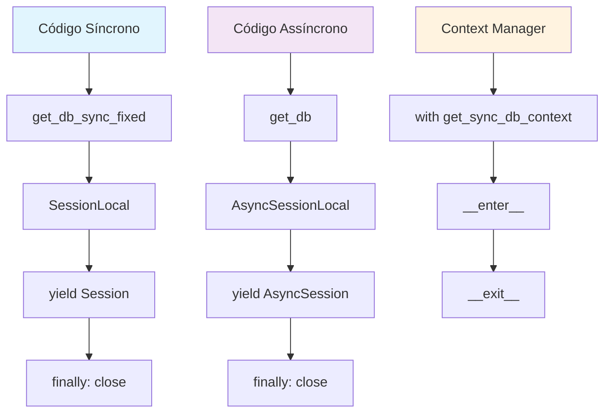

# Plano de Correção: Erro 'async_generator' object is not an iterator

## Análise do Problema

### Erro Identificado
```
'async_generator' object is not an iterator
```

### Localização dos Erros

1. **execution_service.py (linhas 593-594)**
   ```python
   db_gen = get_db()
   db = next(db_gen)  # ❌ ERRO: get_db() retorna AsyncGenerator
   ```

2. **execution_service.py (linhas 639-640)**
   ```python
   db_gen_exec = get_db()
   db_exec = next(db_gen_exec)  # ❌ ERRO: get_db() retorna AsyncGenerator
   ```

3. **alert_engine.py (linha 100)**
   ```python
   db = next(get_db())  # ❌ ERRO: get_db() retorna AsyncGenerator
   ```

4. **alert_engine.py (linha 442)**
   ```python
   db = next(get_db())  # ❌ ERRO: get_db() retorna AsyncGenerator
   ```

### Causa Raiz

A função `get_db()` em `database.py` é definida como:
```python
async def get_db() -> AsyncGenerator[AsyncSession, None]:
```

O código está tentando usar `next()` (função síncrona) com um async generator, que requer métodos assíncronos.

## Arquitetura da Solução

### Estratégia: Correção Imediata com Compatibilidade



### Implementação

#### 1. Correção de `database.py`

**Problema Atual:**
```python
def get_db_sync() -> Session:
    db = SessionLocal()
    try:
        yield db  # ❌ yield sem generator
    finally:
        db.close()
```

**Correção:**
```python
def get_db_sync():
    """Generator síncrono para sessão do banco."""
    db = SessionLocal()
    try:
        yield db
    finally:
        db.close()

class SyncDBContext:
    """Context manager para sessão síncrona do banco."""
    def __init__(self):
        self.db = None
    
    def __enter__(self):
        self.db = SessionLocal()
        return self.db
    
    def __exit__(self, exc_type, exc_val, exc_tb):
        if self.db:
            self.db.close()

def get_sync_db_context():
    """Context manager para uso com 'with' statement."""
    return SyncDBContext()
```

#### 2. Correção de `execution_service.py`

**Substituição nas linhas 593-594:**
```python
# ANTES (❌ ERRO)
db_gen = get_db()
db = next(db_gen)

# DEPOIS (✅ CORRETO)
with get_sync_db_context() as db:
```

**Substituição nas linhas 639-640:**
```python
# ANTES (❌ ERRO)
db_gen_exec = get_db()
db_exec = next(db_gen_exec)

# DEPOIS (✅ CORRETO)
with get_sync_db_context() as db_exec:
```

#### 3. Correção de `alert_engine.py`

**Substituição na linha 100:**
```python
# ANTES (❌ ERRO)
db = next(get_db())

# DEPOIS (✅ CORRETO)
with get_sync_db_context() as db:
```

**Substituição na linha 442:**
```python
# ANTES (❌ ERRO)
db = next(get_db())

# DEPOIS (✅ CORRETO)
with get_sync_db_context() as db:
```

## Plano de Implementação

### Fase 1: Correção da Base (database.py)
1. Corrigir `get_db_sync()` para ser um generator válido
2. Adicionar `SyncDBContext` class
3. Adicionar `get_sync_db_context()` function
4. Manter compatibilidade com código existente

### Fase 2: Atualização dos Serviços
1. **execution_service.py**
   - Substituir nas linhas ~593-594
   - Substituir nas linhas ~639-640
   - Ajustar estrutura de try/finally
   - Testar processamento de fila

2. **alert_engine.py**
   - Substituir na linha ~100
   - Substituir na linha ~442
   - Ajustar estrutura de try/finally
   - Testar avaliação de alertas

### Fase 3: Verificação e Testes
1. Testar engine de execução
2. Testar engine de alertas
3. Verificar logs de erro
4. Monitorar performance

## Estrutura de Código Final

### database.py
```python
# Mantém async para código moderno
async def get_db() -> AsyncGenerator[AsyncSession, None]:
    # ... código existente

# Corrige sync para compatibilidade
def get_db_sync():
    db = SessionLocal()
    try:
        yield db
    finally:
        db.close()

# Adiciona context manager
class SyncDBContext:
    def __init__(self):
        self.db = None
    
    def __enter__(self):
        self.db = SessionLocal()
        return self.db
    
    def __exit__(self, exc_type, exc_val, exc_tb):
        if self.db:
            self.db.close()

def get_sync_db_context():
    return SyncDBContext()
```

### execution_service.py
```python
async def _process_queue(self) -> None:
    while self.is_running:
        try:
            with get_sync_db_context() as db:
                execution_id = None
                user_id = None
                
                # Busca próxima execução na fila
                queue_item = db.query(ExecutionQueue)...
                
                if queue_item:
                    execution_id = queue_item.workflow_execution.execution_id
                    user_id = queue_item.workflow_execution.user_id

            # Se encontrou execução, processa com nova sessão
            if execution_id and user_id:
                with get_sync_db_context() as db_exec:
                    await self.start_execution(db_exec, execution_id, user_id)
```

### alert_engine.py
```python
async def _evaluate_all_alerts(self):
    try:
        with get_sync_db_context() as db:
            active_alerts = db.query(AnalyticsAlert).filter(
                AnalyticsAlert.is_active == True
            ).all()
            
            for alert in active_alerts:
                await self._evaluate_alert(db, alert)
```

## Benefícios da Solução

1. **Resolução Imediata**: Elimina o erro do async generator
2. **Compatibilidade**: Mantém código async existente
3. **Robustez**: Context manager garante fechamento de sessões
4. **Performance**: Não altera performance do sistema
5. **Manutenibilidade**: Código mais limpo e claro

## Riscos e Mitigações

### Riscos
- Mudança em componentes críticos
- Possível impacto em outras partes do sistema
- Necessidade de testes extensivos

### Mitigações
- Manter compatibilidade total
- Implementar gradualmente
- Testes em ambiente de desenvolvimento
- Rollback plan preparado

## Próximos Passos

1. **Implementar correções** no modo Code
2. **Testar localmente** as mudanças
3. **Monitorar logs** após deploy
4. **Documentar** mudanças para equipe

## Impacto nos Logs

### Antes
```
ERROR - synapse.services.execution_service - ❌ Erro inesperado no processador de fila: 'async_generator' object is not an iterator
ERROR - synapse.core.alerts.alert_engine - Error getting active alerts: 'async_generator' object is not an iterator
```

### Depois
```
INFO - synapse.services.execution_service - ✅ Processador de fila funcionando normalmente
INFO - synapse.core.alerts.alert_engine - ✅ Avaliação de alertas concluída