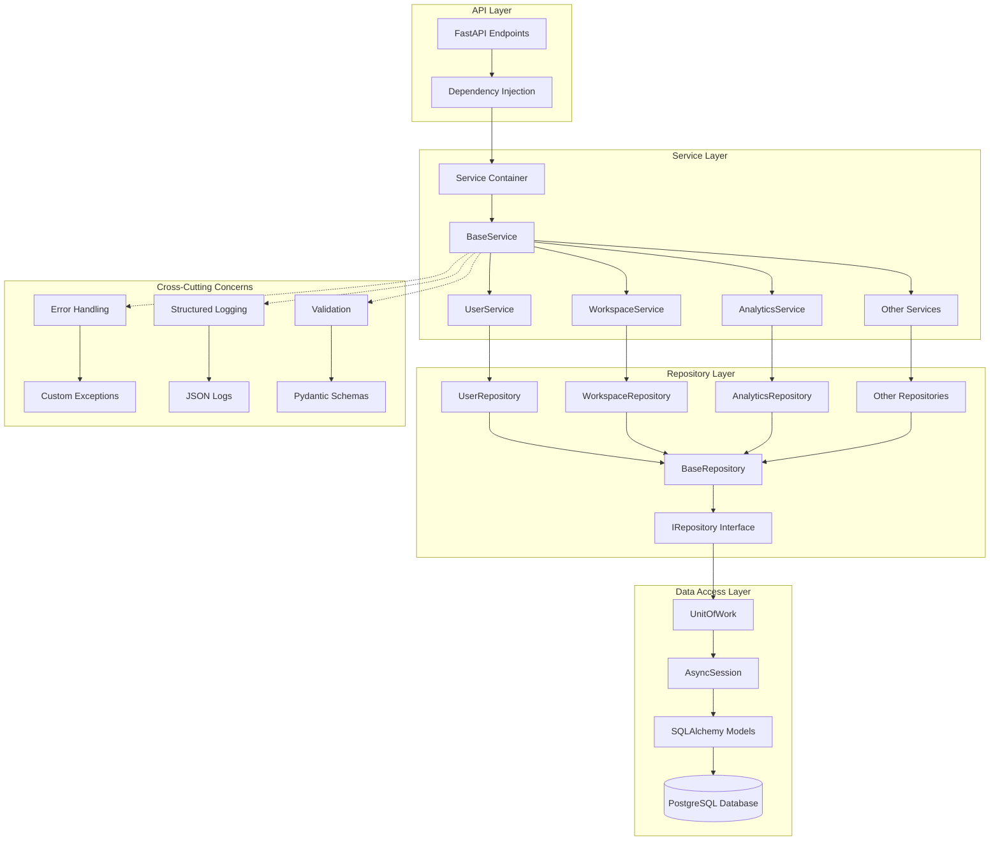

# SynapScale Service Layer Architecture

## Overview

The SynapScale service layer provides a robust, scalable foundation for business logic separation, dependency injection, and database operations. This document outlines the architecture, patterns, and best practices implemented in the service layer.

## Architecture Diagram



## Architecture Components

### 1. Base Service Class

The `BaseService` class serves as the foundation for all service implementations, providing:

- **Generic CRUD Operations**: Create, Read, Update, Delete with type safety
- **Error Handling**: Comprehensive exception management
- **Logging**: Structured logging with contextual information
- **Async Support**: Full async/await pattern implementation
- **Validation**: Pydantic model integration for data validation

```python
from synapse.core.services.base_service import BaseService
from synapse.models.user import User
from synapse.schemas.user import UserCreate, UserUpdate

class UserService(BaseService[User, UserCreate, UserUpdate]):
    """User service implementation extending BaseService."""
    pass
```

### 2. Repository Pattern

The repository pattern abstracts data access logic:

- **IRepository Interface**: Contract for data access operations
- **BaseRepository**: Concrete implementation with SQLAlchemy integration
- **UnitOfWork**: Transaction management pattern
- **Query Abstraction**: Simplified querying with filters and pagination

```python
from synapse.core.services.repository import IRepository, BaseRepository
from synapse.models.user import User

class UserRepository(BaseRepository[User]):
    """User-specific repository implementation."""
    
    async def find_by_email(self, email: str) -> Optional[User]:
        return await self.find_one({"email": email})
```

### 3. Dependency Injection Container

The dependency injection system provides:

- **Service Registration**: Automatic service discovery and registration
- **Lifetime Management**: Singleton, scoped, and transient lifetimes
- **Factory Functions**: Service instantiation with dependencies
- **FastAPI Integration**: Seamless integration with FastAPI's DI system

```python
from synapse.core.services.dependency_container import ServiceContainer

# Service registration
container = ServiceContainer()
container.register_singleton(UserService)
container.register_scoped(DatabaseService)
container.register_transient(EmailService)
```

## File Structure

```
src/synapse/
├── core/
│   ├── services/
│   │   ├── __init__.py
│   │   ├── base_service.py          # Base service class
│   │   ├── repository.py            # Repository pattern implementation
│   │   ├── dependency_container.py  # DI container
│   │   └── service_configuration.py # Service configuration
│   ├── logging_system.py           # Structured logging
│   └── exceptions.py               # Custom exceptions
├── services/
│   ├── __init__.py
│   ├── user_service.py             # Example service implementation
│   └── [other_services].py
├── models/                         # SQLAlchemy models
├── schemas/                        # Pydantic schemas
└── api/                           # API endpoints
```

## Key Features

### Generic Type Safety

```python
from typing import TypeVar, Generic
from sqlalchemy.ext.declarative import DeclarativeMeta
from pydantic import BaseModel

ModelType = TypeVar("ModelType", bound=DeclarativeMeta)
CreateSchemaType = TypeVar("CreateSchemaType", bound=BaseModel)
UpdateSchemaType = TypeVar("UpdateSchemaType", bound=BaseModel)

class BaseService(Generic[ModelType, CreateSchemaType, UpdateSchemaType]):
    """Type-safe base service with generic operations."""
```

### Comprehensive Error Handling

```python
from synapse.exceptions import (
    ServiceError,
    DatabaseError,
    NotFoundError,
    ValidationError
)

class UserService(BaseService[User, UserCreate, UserUpdate]):
    async def create_user(self, user_data: UserCreate) -> User:
        try:
            # Validate unique email
            existing = await self.repository.find_by_email(user_data.email)
            if existing:
                raise ValidationError("Email already exists")
            
            return await self.create(user_data)
        except ValidationError:
            raise  # Re-raise validation errors
        except Exception as e:
            raise ServiceError(f"Failed to create user: {str(e)}")
```

### Structured Logging

```python
import logging
from synapse.core.logging_system import get_logger

logger = get_logger(__name__)

class UserService(BaseService[User, UserCreate, UserUpdate]):
    async def create_user(self, user_data: UserCreate) -> User:
        logger.info(
            "Creating new user",
            extra={
                "email": user_data.email,
                "operation": "create_user",
                "service": "UserService"
            }
        )
        # Implementation...
```

## Usage Guidelines

### 1. Creating a New Service

1. **Define the Model and Schemas**:
```python
# models/product.py
class Product(Base):
    __tablename__ = "products"
    id = Column(Integer, primary_key=True)
    name = Column(String, nullable=False)
    price = Column(Numeric, nullable=False)

# schemas/product.py
class ProductBase(BaseModel):
    name: str
    price: Decimal

class ProductCreate(ProductBase):
    pass

class ProductUpdate(ProductBase):
    name: Optional[str] = None
    price: Optional[Decimal] = None

class ProductResponse(ProductBase):
    id: int
    created_at: datetime
    
    class Config:
        from_attributes = True
```

2. **Implement the Service**:
```python
# services/product_service.py
from synapse.core.services.base_service import BaseService
from synapse.models.product import Product
from synapse.schemas.product import ProductCreate, ProductUpdate

class ProductService(BaseService[Product, ProductCreate, ProductUpdate]):
    """Product service for business logic operations."""
    
    async def get_products_by_category(self, category: str) -> List[Product]:
        """Get products filtered by category."""
        return await self.repository.find_many({"category": category})
    
    async def update_price(self, product_id: int, new_price: Decimal) -> Product:
        """Update product price with validation."""
        if new_price <= 0:
            raise ValidationError("Price must be positive")
        
        return await self.update(product_id, {"price": new_price})
```

3. **Register in Dependency Container**:
```python
# core/services/service_configuration.py
def configure_services(container: ServiceContainer):
    container.register_scoped(ProductService)
    # Other service registrations...
```

4. **Use in API Endpoints**:
```python
# api/v1/endpoints/products.py
from fastapi import APIRouter, Depends
from synapse.services.product_service import ProductService
from synapse.core.services.dependency_container import get_service

router = APIRouter()

@router.post("/products/", response_model=ProductResponse)
async def create_product(
    product_data: ProductCreate,
    service: ProductService = Depends(get_service(ProductService))
):
    return await service.create(product_data)
```

### 2. Database Operations

The service layer provides several patterns for database operations:

#### Basic CRUD Operations
```python
# Create
user = await user_service.create(user_create_data)

# Read
user = await user_service.get(user_id)
users = await user_service.list(skip=0, limit=100)

# Update
user = await user_service.update(user_id, user_update_data)

# Delete
await user_service.delete(user_id)
```

#### Advanced Queries
```python
# Using repository for complex queries
users = await user_service.repository.find_many(
    filters={"active": True, "role": "admin"},
    order_by="created_at",
    limit=50
)

# With relationships
users = await user_service.repository.find_many(
    filters={"active": True},
    include_relationships=["profile", "workspaces"]
)
```

#### Bulk Operations
```python
# Bulk create
users = await user_service.bulk_create([user1_data, user2_data, user3_data])

# Bulk update
await user_service.bulk_update(
    filters={"role": "user"},
    update_data={"notification_enabled": True}
)
```

### 3. Transaction Management

```python
from synapse.core.services.repository import UnitOfWork

async def transfer_workspace_ownership(
    workspace_id: int, 
    from_user_id: int, 
    to_user_id: int
) -> None:
    async with UnitOfWork() as uow:
        # Update workspace owner
        await uow.workspaces.update(workspace_id, {"owner_id": to_user_id})
        
        # Log the transfer
        await uow.audit_logs.create({
            "action": "workspace_transfer",
            "workspace_id": workspace_id,
            "from_user_id": from_user_id,
            "to_user_id": to_user_id
        })
        
        # Commit all changes together
        await uow.commit()
```

## Best Practices

### 1. Service Design Principles

- **Single Responsibility**: Each service should handle one domain area
- **Dependency Injection**: Use DI for all dependencies
- **Interface Segregation**: Create specific interfaces for complex services
- **Error Handling**: Always handle and log errors appropriately
- **Type Safety**: Use generic types for compile-time safety

### 2. Error Handling Patterns

```python
class UserService(BaseService[User, UserCreate, UserUpdate]):
    async def create_user(self, user_data: UserCreate) -> User:
        try:
            # Business logic validation
            if await self._email_exists(user_data.email):
                raise ValidationError("Email already registered")
            
            # Create user
            user = await self.create(user_data)
            
            # Log success
            self.logger.info(f"User created successfully: {user.id}")
            
            return user
            
        except ValidationError:
            # Re-raise business logic errors
            raise
        except DatabaseError as e:
            # Handle database errors
            self.logger.error(f"Database error creating user: {e}")
            raise ServiceError("Failed to create user due to database error")
        except Exception as e:
            # Handle unexpected errors
            self.logger.error(f"Unexpected error creating user: {e}")
            raise ServiceError("An unexpected error occurred")
```

### 3. Logging Best Practices

```python
import logging
from synapse.core.logging_system import get_logger

class UserService(BaseService[User, UserCreate, UserUpdate]):
    def __init__(self, *args, **kwargs):
        super().__init__(*args, **kwargs)
        self.logger = get_logger(f"{__name__}.{self.__class__.__name__}")
    
    async def create_user(self, user_data: UserCreate) -> User:
        # Log operation start
        self.logger.info(
            "Starting user creation",
            extra={
                "operation": "create_user",
                "email": user_data.email,
                "service": "UserService"
            }
        )
        
        try:
            user = await self.create(user_data)
            
            # Log success
            self.logger.info(
                "User created successfully",
                extra={
                    "operation": "create_user",
                    "user_id": user.id,
                    "email": user.email,
                    "service": "UserService"
                }
            )
            
            return user
            
        except Exception as e:
            # Log error with context
            self.logger.error(
                "Failed to create user",
                extra={
                    "operation": "create_user",
                    "email": user_data.email,
                    "error": str(e),
                    "service": "UserService"
                }
            )
            raise
```

## Performance Considerations

### 1. Database Connection Pooling

The service layer uses SQLAlchemy's async connection pooling:

```python
# database.py
engine = create_async_engine(
    DATABASE_URL,
    pool_size=20,          # Number of connections to maintain
    max_overflow=0,        # Additional connections beyond pool_size
    pool_pre_ping=True,    # Verify connections before use
    pool_recycle=3600,     # Recycle connections every hour
)
```

### 2. Query Optimization

```python
class UserService(BaseService[User, UserCreate, UserUpdate]):
    async def get_users_with_workspaces(self, limit: int = 100) -> List[User]:
        """Optimized query with eager loading."""
        return await self.repository.find_many(
            filters={},
            include_relationships=["workspaces"],  # Eager load relationships
            limit=limit,
            order_by="created_at"
        )
    
    async def get_user_count_by_role(self) -> Dict[str, int]:
        """Optimized aggregation query."""
        return await self.repository.aggregate(
            group_by="role",
            aggregates={"count": "id"}
        )
```

### 3. Caching Strategy

```python
from functools import lru_cache
from typing import Optional

class UserService(BaseService[User, UserCreate, UserUpdate]):
    @lru_cache(maxsize=1000)
    async def get_user_permissions(self, user_id: int) -> List[str]:
        """Cache user permissions for performance."""
        user = await self.get(user_id)
        if not user:
            return []
        
        # Calculate permissions based on user role and workspace memberships
        permissions = []
        # ... permission logic
        return permissions
```

## Security Considerations

### 1. Input Validation

```python
from pydantic import validator
from synapse.schemas.user import UserCreate

class UserCreateSecure(UserCreate):
    @validator('email')
    def validate_email(cls, v):
        # Additional email validation beyond Pydantic's EmailStr
        if '@' not in v or len(v) > 255:
            raise ValueError('Invalid email format')
        return v.lower().strip()
    
    @validator('password')
    def validate_password(cls, v):
        if len(v) < 8:
            raise ValueError('Password must be at least 8 characters')
        return v
```

### 2. Authorization Patterns

```python
from synapse.core.security import require_permission

class WorkspaceService(BaseService[Workspace, WorkspaceCreate, WorkspaceUpdate]):
    @require_permission("workspace.read")
    async def get_workspace(self, workspace_id: int, user_id: int) -> Workspace:
        """Get workspace with authorization check."""
        workspace = await self.get(workspace_id)
        
        # Additional authorization logic
        if not await self._user_has_access(user_id, workspace_id):
            raise AuthorizationError("Access denied to workspace")
        
        return workspace
```

## Testing Integration

### Service Layer Tests

```python
import pytest
from unittest.mock import AsyncMock, MagicMock
from synapse.services.user_service import UserService
from synapse.schemas.user import UserCreate

@pytest.fixture
def mock_repository():
    repository = AsyncMock()
    return repository

@pytest.fixture
def user_service(mock_repository):
    service = UserService()
    service.repository = mock_repository
    return service

@pytest.mark.asyncio
async def test_create_user_success(user_service, mock_repository):
    # Arrange
    user_data = UserCreate(email="test@example.com", name="Test User")
    expected_user = User(id=1, email="test@example.com", name="Test User")
    mock_repository.create.return_value = expected_user
    
    # Act
    result = await user_service.create(user_data)
    
    # Assert
    assert result == expected_user
    mock_repository.create.assert_called_once_with(user_data)
```

## Implemented Components

### ✅ Base Service Class (`src/synapse/core/services/base_service.py`)
- Generic CRUD operations with type safety
- Comprehensive error handling and logging
- Async/await pattern support
- Pydantic model integration
- Bulk operations and soft delete functionality

### ✅ Repository Pattern (`src/synapse/core/services/repository.py`)
- `IRepository` interface for data access abstraction
- `BaseRepository` with full CRUD operations
- `UnitOfWork` pattern for transaction management
- Support for filtering, pagination, and relationship loading

### ✅ Dependency Injection (`src/synapse/core/services/dependency_container.py`)
- Service container with lifetime management
- Factory functions for service resolution
- FastAPI integration
- Database session management

### ✅ Error Handling System (`src/synapse/exceptions.py` + `src/synapse/middlewares/error_middleware.py`)
- Custom exception hierarchy
- Global exception handlers
- Error response standardization
- Error tracking and analytics

### ✅ Structured Logging (`src/synapse/core/logging_system.py`)
- JSON-formatted structured logs
- Contextual information capture
- Error tracking and metrics
- Performance monitoring

### ✅ Service Implementation Example (`src/synapse/services/user_service.py`)
- Concrete service extending BaseService
- Business logic separation
- Repository pattern integration

## Integration Test Results

All service layer components have been thoroughly tested:

✅ **Service Configuration**: 10 services registered successfully  
✅ **Database Session**: Async session creation and management  
✅ **Service Resolution**: Dependency injection working correctly  
✅ **CRUD Operations**: All basic operations (Create, Read, Update, Delete)  
✅ **Error Handling**: Custom exceptions and standardized responses  
✅ **Transaction Rollback**: Proper error recovery and data consistency  
✅ **Dependency Injection Scoping**: Correct lifetime management  
✅ **Custom Repository Methods**: Extended functionality working  
✅ **Structured Logging**: JSON logs with contextual information  

## Conclusion

The SynapScale service layer provides a robust foundation for scalable application development with:

- **Clean Architecture**: Separation of concerns between data access, business logic, and presentation
- **Type Safety**: Full generic type safety in Python
- **Scalability**: Built-in patterns for handling growth and complexity
- **Testability**: Easy mocking and testing of business logic
- **Observability**: Comprehensive logging, metrics, and health checks
- **Security**: Built-in validation, authorization, and error handling

This architecture enables rapid development while maintaining code quality, performance, and maintainability as the application scales. 