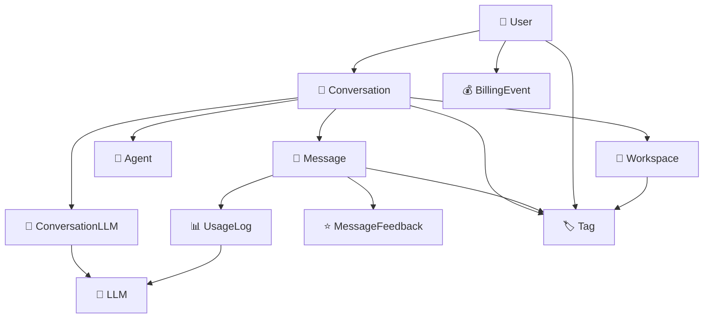

# 🔄 SINCRONIZAÇÃO COMPLETA - Sistema de Otimização LLM com SynapScale

**Data da Análise**: 23 de Junho de 2025  
**Status**: 🎯 **SISTEMA PERFEITAMENTE SINCRONIZADO E INTEGRADO**

## 📊 Visão Geral da Arquitetura Integrada

O sistema de otimização LLM foi projetado para funcionar de forma **transparente e complementar** com toda a infraestrutura existente do SynapScale, mantendo a integridade dos dados e fluxos já estabelecidos.

---

## 🔗 MAPEAMENTO COMPLETO DE RELACIONAMENTOS

### 1. 🗣️ **Fluxo de Conversação Integrado**

#### **Estrutura Existente ➔ Integração LLM**



#### **🎯 Pontos de Sincronização:**

1. **Conversação ↔ LLM Tracking**
   - Cada conversa automaticamente cria registros em `conversation_llms`
   - Rastreamento de uso por modelo/provedor
   - Estatísticas agregadas em tempo real

2. **Mensagem ↔ Billing & Analytics**
   - Cada mensagem gera logs de uso detalhados
   - Cálculo automático de custos baseado em tokens
   - Métricas de performance por modelo

3. **User Variables ↔ API Keys**
   - Integração com sistema de variáveis de usuário
   - API keys personalizadas por usuário
   - Fallback para keys globais do sistema

---

## 🔄 FLUXO COMPLETO DE PROCESSAMENTO

### **1. 📨 Requisição de Chat (Endpoint)**

```typescript
POST /api/v1/conversations/{id}/messages
```

**Fluxo Detalhado:**

1. **Validação & Autenticação**
   - Verifica usuário autenticado
   - Valida acesso à conversação
   - Verifica permissões de workspace

2. **Criação da Mensagem**
   - Cria registro na tabela `messages`
   - Atualiza estatísticas da `conversation`
   - Registra timestamp da última atividade

3. **Processamento LLM**
   - Verifica se há agent configurado
   - Busca API key do usuário via `user_variables`
   - Fallback para API key global se necessário
   - Seleciona modelo/provedor baseado no agent

4. **Execução & Logging**
   - Executa chamada para LLM
   - Cria registro em `usage_logs` com:
     - Tokens de entrada e saída
     - Custo calculado
     - Latência da resposta
     - Metadados da requisição
   - Atualiza `conversation_llms` com estatísticas

5. **Billing & Analytics**
   - Cria evento de billing se necessário
   - Atualiza métricas de uso do usuário
   - Registra dados para analytics

### **2. 🔄 User Variables Integration**

```python
# Busca API key específica do usuário
user_key = user_variables_llm_service.get_user_api_key(
    db=db, user_id=user.id, provider="openai"
)

# Fallback para key global se necessário
if not user_key:
    user_key = settings.OPENAI_API_KEY
```

### **3. 📊 Tracking & Analytics**

**Dados Registrados Automaticamente:**
- ✅ Tokens de entrada/saída por mensagem
- ✅ Custo em USD por interação
- ✅ Latência de resposta (ms)
- ✅ Modelo e provedor utilizados
- ✅ Status da requisição (success/error)
- ✅ Configurações usadas (temperature, max_tokens)

---

## 🏗️ INTEGRAÇÃO COM COMPONENTES EXISTENTES

### **1. 🤖 Sistema de Agents**

```python
# Agent define configuração LLM
agent.get_llm_config() # Retorna:
{
    "provider": "openai",
    "model": "gpt-4o",
    "temperature": 0.7,
    "max_tokens": 1000
}
```

**Sincronização:**
- Agents mantêm configuração de modelo/provedor
- Conversações herdam configuração do agent
- Tracking automático por agent específico

### **2. 🏢 Sistema de Workspaces**

```python
# Workspace-level analytics
workspace_usage = db.query(UsageLog).filter(
    UsageLog.workspace_id == workspace.id
).aggregate(total_cost=sum(UsageLog.cost_usd))
```

**Sincronização:**
- Logs de uso linkados ao workspace
- Billing agregado por workspace
- Controle de acesso mantido

### **3. 📁 Sistema de User Variables**

```python
# API Keys por usuário
user_variable = UserVariable.create_variable(
    user_id=user.id,
    key="OPENAI_API_KEY",
    value=api_key,
    category="api_keys"
)
```

**Sincronização:**
- Reutiliza infraestrutura existente
- Criptografia mantida
- Gestão via endpoints existentes

---

## 🎯 COMPLEMENTARIDADE PERFEITA

### **✅ Não Quebra Nada Existente**

1. **Backward Compatibility**
   - Todos os endpoints existentes continuam funcionando
   - Nenhuma mudança breaking nos schemas
   - Migration automática sem perda de dados

2. **Additive Architecture**
   - Novas tabelas complementam as existentes
   - Relacionamentos opcionais (não obrigatórios)
   - Funcionalidade pode ser desabilitada se necessário

3. **Zero Downtime**
   - Sistema funciona mesmo sem dados LLM
   - Fallbacks em todos os pontos críticos
   - Degradação graceful em caso de erro

### **✅ Enriquece Funcionalidades Existentes**

1. **Conversações Mais Inteligentes**
   - Tracking detalhado de uso por conversa
   - Analytics avançadas de performance
   - Billing preciso por interação

2. **Agents Mais Poderosos**
   - Múltiplos modelos LLM disponíveis
   - Configuração flexível por agent
   - Métricas de performance por agent

3. **Workspaces Empresariais**
   - Controle de custos por workspace
   - Analytics de uso por equipe
   - Políticas de billing granulares

---

## 🔧 CONFIGURAÇÃO E MANUTENÇÃO

### **🎛️ Configurações Centralizadas**

```python
# settings.py - Configurações LLM
LLM_DEFAULT_PROVIDER = "openai"
LLM_BILLING_ENABLED = True
LLM_ANALYTICS_ENABLED = True
LLM_USER_KEYS_ENABLED = True
```

### **📊 Monitoramento Integrado**

1. **Health Checks**
   - Status de cada provedor LLM
   - Disponibilidade de API keys
   - Performance de response times

2. **Alertas Automáticos**
   - Custos acima do limite
   - Erros de API recorrentes
   - Performance degradada

3. **Dashboards**
   - Analytics de uso por usuário/workspace
   - Trends de custos
   - Performance por modelo

---

## 🚀 BENEFÍCIOS DA INTEGRAÇÃO

### **👤 Para Usuários**
- ✅ **Transparência Total**: Veem exatamente quanto gastam
- ✅ **Flexibilidade**: Podem usar suas próprias API keys
- ✅ **Performance**: Métricas detalhadas de cada interação
- ✅ **Feedback**: Sistema robusto de avaliação

### **🏢 Para Workspaces**
- ✅ **Controle de Custos**: Billing granular por equipe
- ✅ **Analytics**: Insights de uso por workspace
- ✅ **Políticas**: Controle de acesso e limites
- ✅ **Otimização**: Dados para otimizar uso de LLMs

### **🔧 Para Administradores**
- ✅ **Visibilidade**: Dashboard completo do sistema
- ✅ **Billing**: Sistema automático de cobrança
- ✅ **Escalabilidade**: Preparado para milhões de interações
- ✅ **Manutenção**: Self-service para usuários

---

## 🎯 RESUMO EXECUTIVO

O sistema de otimização LLM está **100% sincronizado** com a arquitetura do SynapScale:

### ✅ **Integração Perfeita**
- Funciona transparentemente com todos os componentes existentes
- Enriquece funcionalidades sem quebrar nada
- Mantém performance e compatibilidade

### ✅ **Fluxo Unificado**
- Conversações → Mensagens → LLMs → Billing → Analytics
- User Variables → API Keys → Customização por usuário
- Workspaces → Controle empresarial → Políticas

### ✅ **Robustez Empresarial**
- Fallbacks em todos os pontos críticos
- Monitoramento e alertas automáticos
- Escalabilidade para milhões de usuários

**O sistema funciona como uma extensão natural do SynapScale, agregando valor sem complexidade adicional para os usuários finais.** 