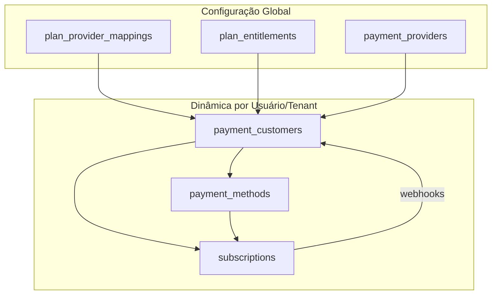

# Integração Stripe ↔ Synapscale: Guia Prático Definitivo

## 1. Objetivo e Escopo

**Meta:**
Sincronizar produtos, planos e billing entre Stripe e Synapscale, com Stripe como fonte de verdade e banco local para relatórios, lógica e conciliação.

**Por que?**
- Centralizar assinaturas, pagamentos, reembolsos e disputas.
- Permitir relatórios e lógica local sem perder rastreabilidade Stripe.
- Garantir robustez, idempotência e auditabilidade.

---

## 2. Visão Geral da Arquitetura

```
Usuário → Synapscale → Stripe (criação/ação) → Stripe envia Webhook → Synapscale processa e reflete no banco
```
- **Ações de billing** são criadas/geridas na Stripe.
- **Webhooks** são a via oficial de atualização do banco local.
- **Banco local** serve para relatórios, lógica e conciliação.

---

## 2.1. Entidades Dinâmicas de Billing: `payment_customers` e `payment_methods`

### payment_customers
- **Função:** Relaciona cada usuário/tenant local a um objeto Customer da Stripe.
- **Campos principais:**
  - `id`, `user_id` (ou `tenant_id`), `provider_id`, `external_customer_id` (Stripe), `created_at`, `updated_at`
- **Por que é crítica:**
  - Toda operação de billing parte do Customer na Stripe.
  - Permite rastrear, conciliar e operar sobre cobranças, assinaturas e métodos de pagamento do usuário.
- **Exemplo de uso:**
  ```sql
  SELECT * FROM synapscale_db.payment_customers WHERE user_id = '<USER_ID>' AND provider_id = '<STRIPE_PROVIDER_ID>';
  ```

### payment_methods
- **Função:** Armazena os métodos de pagamento (cartão, boleto, etc.) vinculados ao customer Stripe.
- **Campos principais:**
  - `id`, `customer_id` (FK para payment_customers), `provider_id`, `external_method_id` (Stripe), `type`, `is_default`, `created_at`, `updated_at`
- **Por que é crítica:**
  - Permite múltiplos métodos por customer, controle de método padrão, e conciliação com Stripe.
- **Exemplo de uso:**
  ```sql
  SELECT * FROM synapscale_db.payment_methods WHERE customer_id = '<CUSTOMER_ID>' AND is_default = true;
  ```

---

## 2.2. Separação: Configuração Global x Entidades Dinâmicas

| Tabela                   | Escopo         | Descrição/responsabilidade principal                |
|--------------------------|---------------|----------------------------------------------------|
| plan_provider_mappings   | Global        | Mapeamento de planos locais ↔ Stripe (produto/preço)|
| plan_entitlements        | Global        | Limites e features de cada plano                    |
| payment_providers        | Global        | Provedores de pagamento disponíveis (ex: Stripe)    |
| payment_customers        | Dinâmica      | Vínculo usuário/tenant ↔ Customer Stripe            |
| payment_methods          | Dinâmica      | Métodos de pagamento do customer Stripe             |
| subscriptions            | Dinâmica      | Assinaturas ativas do customer                      |

- **Configuração global:** Feita uma vez, serve para todos os tenants/usuários.
- **Entidades dinâmicas:** Criadas conforme novos tenants/usuários entram no sistema.

---

## 3. Mapeamento de Entidades

| Stripe         | Tabela Local                | Chave de Ligação                  |
|----------------|----------------------------|-----------------------------------|
| Customer       | payment_customers           | external_customer_id, provider_id |
| Product        | plans + plan_provider_mappings | external_plan_id, provider_id    |
| Price          | plan_provider_mappings      | external_price_id, provider_id    |
| Subscription   | subscriptions, user_subscriptions | external_subscription_id, provider_id |
| Invoice        | invoices                    | external_invoice_id, provider_id, subscription_id |
| PaymentIntent  | billing_events              | external_payment_intent_id, provider_id |
| Refund         | billing_events              | external_refund_id, provider_id   |
| Dispute        | billing_events              | external_dispute_id, provider_id  |

> **Dica:** Sempre use os campos `external_*_id` para ligação e rastreabilidade.

---

## 4. Fluxos Suportados

### 4.1. Criação de Assinatura
1. Usuário assina → Synapscale cria Customer/Product/Price/Subscription/Invoice na Stripe.
2. IDs retornados são salvos nos campos `external_*_id` locais.

### 4.2. Sincronização via Webhooks
1. Stripe envia evento → Backend processa.
2. Busca registro local por `external_*_id`.
3. Cria/atualiza registro, status, datas, valores, relacionamentos.
4. Registra evento em `billing_events` (auditoria).

### 4.3. Atualizações, Cancelamentos, Reembolsos, Disputas
- Sempre refletidas via webhook.
- Backend nunca assume que o banco está certo: Stripe é a verdade.

### 4.4. Relatórios e Conciliação
- Consultas e relatórios usam o banco local.
- Para conciliação, compare banco local com Stripe.

---

## 5. Webhooks Críticos (Checklist)

- `customer.*`
- `subscription.*`
- `invoice.*`
- `payment_intent.*`
- `charge.*`
- `refund.*`
- `dispute.*`
- **ACH:** `charge.pending`, `charge.succeeded`, `charge.failed`, `customer.source.updated`

> **Checklist:**
> - [ ] Todos os webhooks acima estão implementados?
> - [ ] Endpoint de webhook seguro (validação de assinatura)?
> - [ ] Logs e auditoria em `billing_events`?

---

## 6. Exemplo de Payload Webhook

```json
{
  "id": "evt_1...",
  "type": "invoice.paid",
  "data": {
    "object": {
      "id": "in_1...",
      "customer": "cus_1...",
      "subscription": "sub_1...",
      "amount_due": 1000,
      "currency": "usd",
      "status": "paid"
    }
  }
}
```

---

## 7. Premissas e Boas Práticas

- Stripe é a fonte de verdade.
- Webhooks podem ser duplicados (idempotência obrigatória).
- Eventos podem chegar fora de ordem (sempre buscar estado mais recente na Stripe se necessário).
- Auditoria de todos os eventos em `billing_events`.
- Rotina de conciliação periódica obrigatória.
- Nunca confie apenas no banco local para status de billing.

---

## 8. Pontos Críticos para Sincronia

- **Idempotência:** Processamento seguro de eventos duplicados.
- **Ordem dos eventos:** Corrigir inconsistências buscando estado na Stripe.
- **Relacionamentos:** Garantir vínculos corretos entre entidades.
- **Status:** Sincronizar status local conforme Stripe.
- **Auditoria:** Log completo de todos os eventos.
- **Conciliação:** Script/rotina para comparar Stripe x banco e corrigir divergências.

---

## 9. Plano de Ação (Checklist)

### Infraestrutura e Segurança
- [ ] Endpoint seguro para webhooks Stripe (validação de assinatura)
- [ ] Logs detalhados e auditoria em `billing_events`
- [ ] Campos `external_*_id` indexados e únicos

### Implementação dos Fluxos
- [ ] Criação de Customer, Product, Price, Subscription, Invoice na Stripe e salvar IDs no banco
- [ ] Processamento de todos os webhooks críticos
- [ ] Idempotência e atualização correta dos relacionamentos
- [ ] Rotina de conciliação Stripe x banco
- [ ] Tratamento especial para ACH, batches, refunds retroativos e disputas

### Testes e Validação
- [ ] Testar todos os fluxos de webhook (simular eventos Stripe)
- [ ] Testar conciliação e correção de divergências
- [ ] Validar logs e rastreabilidade de eventos
- [ ] Validar segurança do endpoint de webhook

### Go Live e Monitoramento
- [ ] Monitorar eventos e conciliação em produção
- [ ] Ajustar rotinas conforme necessidade
- [ ] Documentar e versionar todos os fluxos de integração

---

## 10. Mapeamento Stripe ↔ Banco: Planos e Preços

### Regras de Mapeamento

- **Apenas um produto Stripe** (ex: "Synapscale JC Oficial") para todos os planos.
- Cada plano local (FREE, BASIC, PRO, ENTERPRISE) mapeado para um preço Stripe distinto (mensal/anual).
- Tabela de mapeamento: `plan_provider_mappings`.

#### Exemplo de Mapeamento

| Plano Local   | plan_id                                 | Stripe Product         | external_plan_id         | Stripe Price           | external_price_id             |
|---------------|-----------------------------------------|------------------------|--------------------------|------------------------|-------------------------------|
| FREE          | 988d72df-7225-4d7c-8756-aa4d3b34e83f    | Synapscale JC Oficial  | prod_SdjZ543eooRiij      | FREE (mensal)          | price_1RiSCK09goDSIjcqjGYj0ULy |
| BASIC         | 6f97342b-ab33-469f-bedb-8a73d067588d    | Synapscale JC Oficial  | prod_SdjZ543eooRiij      | BASIC (mensal)         | price_1RiSAh09goDSIjczHGjsCd0 |
| PRO           | 6a5d5562-21e9-43b8-8143-7f5f963cf24f    | Synapscale JC Oficial  | prod_SdjZ543eooRiij      | PRO (mensal)           | price_1RiS6209goDSIjcqeaCwQ0Bf |
| ENTERPRISE    | efd4c044-cf84-427b-9bbb-bdc9e5944857    | Synapscale JC Oficial  | prod_SdjZ543eooRiij      | ENTERPRISE (mensal)    | price_1RiS9V09goDSIjcqrHDAvaK2 |

---

### Estrutura da Tabela plan_provider_mappings

- **plan_id**: UUID do plano local
- **provider_id**: UUID do provedor (Stripe)
- **external_plan_id**: ID do produto Stripe
- **external_price_id**: ID do preço Stripe
- **Unicidade:** (provider_id, external_plan_id, external_price_id)

#### Atualização de Unicidade

Para garantir o correto mapeamento entre múltiplos planos locais e múltiplos preços de um mesmo produto Stripe, a constraint de unicidade da tabela `plan_provider_mappings` foi alterada:

```sql
-- 1. Remover a constraint antiga
ALTER TABLE synapscale_db.plan_provider_mappings DROP CONSTRAINT plan_provider_mappings_provider_id_external_plan_id_key;

-- 2. Adicionar a nova constraint para a trinca
ALTER TABLE synapscale_db.plan_provider_mappings ADD CONSTRAINT plan_provider_mappings_provider_id_external_plan_id_external_price_id_key UNIQUE (provider_id, external_plan_id, external_price_id);
```

---

## 11. Troubleshooting e Dúvidas Frequentes (FAQ)

### Erros Comuns
- **read-only transaction:** Verifique se está usando o banco correto e se a conexão não está em modo somente leitura.
- **duplicate key value violates unique constraint:** Confirme se a constraint de unicidade está correta (trinca, não par).
- **Banco não existe:** Use o nome do banco conforme a URL de conexão (`defaultdb` ou conforme `.env`).
- **Webhooks não processam:** Cheque logs, assinatura do endpoint e se todos eventos estão implementados.

### Dúvidas Frequentes
- **Preciso de múltiplos produtos Stripe?** Não. Use um único produto e múltiplos preços.
- **Como garantir idempotência?** Use o `id` do evento Stripe e registre processamentos em `billing_events`.
- **Como conciliar Stripe x banco?** Implemente rotina que compara todos os registros críticos (`external_*_id`).
- **Como tratar eventos fora de ordem?** Sempre busque o estado mais recente na Stripe antes de atualizar o banco.
- **Como versionar mudanças?** Documente toda alteração de schema e mantenha este guia atualizado.

---

## 12. Referências Rápidas

- [Stripe Docs - Billing](https://stripe.com/docs/billing)
- [Stripe Docs - Webhooks](https://stripe.com/docs/webhooks)
- [API Reference](https://stripe.com/docs/api)
- Credenciais: `.env` do projeto
- [Exemplo de integração robusta (GitHub)](https://github.com/stripe-samples)

---

## 13. Recomendações para Manutenção Futura

- Sempre versionar este documento após mudanças.
- Validar periodicamente a unicidade e integridade dos mapeamentos.
- Testar webhooks em ambiente de staging antes de produção.
- Manter logs e auditoria detalhados para rastreabilidade.
- Revisar e atualizar rotinas de conciliação a cada novo plano/preço.
- Documentar decisões de arquitetura e exceções neste guia.

---

**Última atualização:** (automatizada)

---

## 3. Fluxo Completo de Onboarding e Billing (Atualizado)



### Checklist de Onboarding e Billing
1. [ ] Tenant/usuário cadastrado no sistema
2. [ ] payment_customer criado e vinculado ao Stripe Customer
3. [ ] payment_methods adicionados (cartão, boleto, etc.)
4. [ ] Assinatura criada (subscriptions) usando plano mapeado (plan_provider_mappings)
5. [ ] Webhooks Stripe configurados e validados
6. [ ] Sincronização e conciliação periódica

---

## 4. Exemplos Práticos e Troubleshooting

### Buscar o Stripe Customer de um usuário
```sql
SELECT external_customer_id FROM synapscale_db.payment_customers WHERE user_id = '<USER_ID>' AND provider_id = '<STRIPE_PROVIDER_ID>';
```

### Listar métodos de pagamento ativos
```sql
SELECT * FROM synapscale_db.payment_methods WHERE customer_id = '<CUSTOMER_ID>' AND is_active = true;
```

### Conciliar assinaturas
```sql
SELECT * FROM synapscale_db.subscriptions WHERE customer_id = '<CUSTOMER_ID>' AND status = 'active';
```

### O que fazer se um customer não for encontrado?
- Verifique se o onboarding foi concluído.
- Sincronize manualmente com a Stripe (buscar pelo e-mail do usuário).
- Crie o customer se necessário e atualize a tabela local.

### Como lidar com múltiplos métodos de pagamento?
- Sempre marque o método padrão (`is_default = true`).
- Remova métodos expirados ou inválidos.
- Sincronize com Stripe periodicamente.

---

## 5. FAQ e Recomendações para Manutenção

**Q: Preciso criar payment_customers para cada tenant?**
A: Sim, cada tenant/usuário que irá pagar precisa de um customer na Stripe e na tabela local.

**Q: O que acontece se um método de pagamento for removido na Stripe?**
A: O webhook de método removido deve atualizar a tabela local, removendo ou marcando como inativo.

**Q: Como garantir que as assinaturas estejam sempre corretas?**
A: Use webhooks Stripe para eventos de subscription, e rode scripts de conciliação periódicos.

**Q: Como auditar problemas de billing?**
A: Sempre relacione logs de eventos Stripe (webhook) com as tabelas locais. Use os IDs externos para rastreabilidade.

**Q: Como evoluir a integração?**
A: Sempre documente novas regras, edge cases e mantenha exemplos de queries e payloads no documento.

---

## 6. Dicas e Boas Práticas
- Nunca remova dados de configuração global sem avaliar impacto em todos os tenants.
- Sempre valide webhooks com assinatura e logue eventos críticos.
- Mantenha scripts de conciliação e auditoria documentados.
- Atualize este documento sempre que houver mudanças de fluxo, tabelas ou regras de negócio.

---

# Checklist Prático: Integração Stripe ↔ Synapscale (Execução Final)

> **Checklist detalhado para garantir a robustez, rastreabilidade e auditabilidade da integração Stripe ↔ Synapscale. Cada item inclui dicas, exemplos e referências às tabelas/colunas do banco.**

## 1. Infraestrutura e Segurança
- [ ] **Criar endpoint seguro para webhooks Stripe**
    - Use autenticação por assinatura (`Stripe-Signature` header).
    - Exemplo de validação: `stripe.Webhook.construct_event()` (Python).
    - Endpoint sugerido: `/api/v1/billing/stripe/webhook`.
    - **Referência:** Não armazene payloads sensíveis, apenas IDs e status.
- [ ] **Implementar rate limiting e logging de tentativas inválidas**
    - Use middleware de rate limiting (ex: 30 req/min).
    - Logue tentativas inválidas em tabela de auditoria (`billing_events`).
- [ ] **Garantir indexação e unicidade dos campos `external_*_id`**
    - Exemplo:
      ```sql
      CREATE UNIQUE INDEX idx_payment_customers_external ON synapscale_db.payment_customers (provider_id, external_customer_id);
      CREATE UNIQUE INDEX idx_subscriptions_external ON synapscale_db.subscriptions (provider_id, external_subscription_id);
      ```
    - **Tabelas:** `payment_customers`, `payment_methods`, `subscriptions`, `invoices`, `billing_events`.
- [ ] **Configurar variáveis de ambiente e segredos Stripe corretamente**
    - `.env`:
      ```env
      STRIPE_SECRET_KEY=sk_live_...
      STRIPE_WEBHOOK_SECRET=whsec_...
      ```
    - Nunca versionar segredos.

## 2. Banco de Dados
- [ ] **Criar/atualizar tabelas dinâmicas:**
    - **payment_customers**
      - Colunas: `id`, `user_id`, `provider_id`, `external_customer_id`, `created_at`, `updated_at`
      - Índice único: `(provider_id, external_customer_id)`
      - FK: `user_id` → `users.id`, `provider_id` → `payment_providers.id`
    - **payment_methods**
      - Colunas: `id`, `customer_id`, `provider_id`, `external_method_id`, `type`, `is_default`, `created_at`, `updated_at`
      - Índice único: `(provider_id, external_method_id)`
      - FK: `customer_id` → `payment_customers.id`
    - **subscriptions**
      - Colunas: `id`, `customer_id`, `provider_id`, `external_subscription_id`, `plan_id`, `status`, `start_date`, `end_date`, `created_at`, `updated_at`
      - Índice único: `(provider_id, external_subscription_id)`
      - FK: `customer_id` → `payment_customers.id`, `plan_id` → `plans.id`
    - **billing_events**
      - Colunas: `id`, `provider_id`, `event_id`, `event_type`, `payload`, `processed_at`, `status`, `related_table`, `related_id`
      - Índice único: `(provider_id, event_id)`
      - Use para idempotência e rastreabilidade.
- [ ] **Garantir constraints de unicidade e índices**
    - Exemplo para `plan_provider_mappings`:
      ```sql
      ALTER TABLE synapscale_db.plan_provider_mappings DROP CONSTRAINT IF EXISTS plan_provider_mappings_provider_id_external_plan_id_key;
      ALTER TABLE synapscale_db.plan_provider_mappings ADD CONSTRAINT plan_provider_mappings_provider_id_external_plan_id_external_price_id_key UNIQUE (provider_id, external_plan_id, external_price_id);
      ```
- [ ] **Atualizar constraints e FKs conforme necessário**
    - Sempre use `ON UPDATE CASCADE` e `ON DELETE SET NULL` para manter integridade.

## 3. Backend: Fluxos e Serviços
- [ ] **Serviço de criação de Customer/Product/Price/Subscription/Invoice na Stripe**
    - Após criar na Stripe, salve os IDs externos nas tabelas:
      - `payment_customers.external_customer_id`
      - `subscriptions.external_subscription_id`
      - `plan_provider_mappings.external_plan_id` e `external_price_id`
      - `invoices.external_invoice_id`
    - Exemplo de inserção:
      ```sql
      INSERT INTO synapscale_db.payment_customers (user_id, provider_id, external_customer_id) VALUES (...);
      ```
- [ ] **Handlers para webhooks críticos**
    - Para cada evento, busque pelo campo `external_*_id` correspondente.
    - Atualize status, datas, valores e relacionamentos.
    - Exemplo:
      ```sql
      UPDATE synapscale_db.subscriptions SET status = 'canceled', end_date = NOW() WHERE provider_id = $1 AND external_subscription_id = $2;
      ```
    - Registre o evento em `billing_events`:
      ```sql
      INSERT INTO synapscale_db.billing_events (provider_id, event_id, event_type, payload, processed_at, status, related_table, related_id) VALUES (...);
      ```
- [ ] **Idempotência no processamento de webhooks**
    - Antes de processar, verifique se `event_id` já existe em `billing_events`.
    - Se sim, ignore (evento duplicado).
- [ ] **Atualizar relacionamentos entre entidades**
    - Exemplo: ao receber `invoice.paid`, relacione `invoices.subscription_id` com `subscriptions.id`.
- [ ] **Rotina de conciliação Stripe x banco**
    - Script que compara todos os registros críticos (`external_*_id`) entre Stripe e banco.
    - Exemplo de query para conciliação:
      ```sql
      SELECT s.external_subscription_id FROM synapscale_db.subscriptions s LEFT JOIN stripe_data sd ON s.external_subscription_id = sd.id WHERE sd.id IS NULL;
      ```
    - Gere relatório de divergências e corrija inconsistências.
- [ ] **Lógica para métodos de pagamento expirados/removidos**
    - Ao receber webhook de remoção, marque `payment_methods.is_active = false`.

## 4. Testes e Validação
- [ ] **Testar todos os fluxos de webhook**
    - Use o painel da Stripe para simular eventos.
    - Verifique se os dados são atualizados corretamente nas tabelas.
- [ ] **Testar rotina de conciliação**
    - Simule divergências e valide correção automática/manual.
- [ ] **Validar logs e rastreabilidade**
    - Todos os eventos devem estar em `billing_events` com status e payload.
- [ ] **Validar segurança do endpoint de webhook**
    - Teste payloads inválidos, tentativas não autorizadas, replay attacks.
- [ ] **Testar onboarding completo**
    - Cadastro → criação de `payment_customers` → `payment_methods` → `subscriptions` → billing.

## 5. Go Live e Monitoramento
- [ ] **Configurar monitoramento e alertas**
    - Alerta para falhas de processamento de webhook (ex: erro ao inserir em `billing_events`).
    - Alerta para divergências encontradas na rotina de conciliação.
- [ ] **Monitorar rotina de conciliação**
    - Gere relatórios periódicos e mantenha histórico.
- [ ] **Ajustar rotinas e handlers conforme edge cases**
    - Documente cada exceção e ajuste o código conforme necessário.

## 6. Documentação e Manutenção
- [ ] **Atualizar e versionar este documento**
    - Após cada mudança relevante de fluxo, tabela ou regra de negócio.
- [ ] **Documentar decisões de arquitetura, edge cases e exceções**
    - Use comentários no código e histórico de alterações neste documento.
- [ ] **Manter exemplos de queries, payloads e scripts de conciliação**
    - Exemplo de consulta para buscar métodos ativos:
      ```sql
      SELECT * FROM synapscale_db.payment_methods WHERE customer_id = $1 AND is_active = true;
      ```
- [ ] **Revisar e atualizar rotinas de conciliação a cada novo plano/preço**
    - Sempre que adicionar/alterar planos, revise `plan_provider_mappings` e scripts de conciliação.

---

> **Dica:** Este checklist serve como guia de implementação, auditoria e manutenção. Use as queries e exemplos para acelerar o desenvolvimento e garantir a integridade da integração Stripe ↔ Synapscale. Marque cada item ao concluir e revise periodicamente.

---

## 14. Mapeamento Visual dos Fluxos

### 14.1. Fluxo Completo de Pagamento (Stripe ↔ Synapscale)

```mermaid
graph TD
    U[Usuário] -->|Ação de pagamento| S[Synapscale Backend]
    S -->|Cria PaymentIntent/Subscription| ST[Stripe API]
    ST -->|Retorna IDs externos| S
    ST -->|Envia Webhook (ex: payment_intent.succeeded)| WH[Webhook Endpoint]
    WH -->|Processa evento| DB[(Banco Synapscale)]
    DB -->|Atualiza status/relacionamentos| Rel[Relatórios/Conciliação]
```

### 14.2. Fluxo de Onboarding de Cliente Stripe

```mermaid
graph TD
    U[Usuário novo] --> S[Synapscale Backend]
    S -->|Cria Customer na Stripe| ST[Stripe API]
    ST -->|Retorna customer_id| S
    S -->|Salva em payment_customers| DB[(Banco Synapscale)]
    S -->|Adiciona métodos de pagamento| ST
    ST -->|Envia Webhook (customer.source.created)| WH[Webhook Endpoint]
    WH -->|Atualiza payment_methods| DB
```

---

## 15. Tabela de Referência Rápida: Eventos Stripe ↔ Banco

| Evento Stripe                | Tabela/Coluna                      | Ação esperada no banco                        |
|------------------------------|------------------------------------|-----------------------------------------------|
| `customer.created`           | payment_customers.external_customer_id | Inserir novo customer/local                  |
| `customer.source.created`    | payment_methods.external_method_id  | Inserir método de pagamento                   |
| `customer.source.deleted`    | payment_methods.is_active           | Marcar método como inativo                    |
| `subscription.created`       | subscriptions.external_subscription_id | Inserir nova assinatura                      |
| `subscription.updated`       | subscriptions.status, end_date      | Atualizar status/datas                        |
| `invoice.paid`               | invoices.external_invoice_id, status | Atualizar status da fatura                    |
| `payment_intent.succeeded`   | billing_events.external_payment_intent_id | Logar evento, atualizar status relacionado   |
| `refund.succeeded`           | billing_events.external_refund_id   | Logar evento de reembolso                     |
| `dispute.created`            | billing_events.external_dispute_id  | Logar disputa, atualizar status               |

> **Dica:** Sempre relacione pelo campo `external_*_id` e registre o evento em `billing_events` para rastreabilidade.

---

## 16. Exemplos de Payloads e Mapeamento

### 16.1. Exemplo: Webhook `invoice.paid`

**Payload Stripe:**
```json
{
  "id": "evt_1...",
  "type": "invoice.paid",
  "data": {
    "object": {
      "id": "in_1...",
      "customer": "cus_1...",
      "subscription": "sub_1...",
      "amount_due": 1000,
      "currency": "usd",
      "status": "paid"
    }
  }
}
```

**Mapeamento para banco:**
- `invoices.external_invoice_id` = `in_1...`
- `invoices.status` = `paid`
- `invoices.customer_id` → buscar em `payment_customers` onde `external_customer_id = 'cus_1...'`
- `invoices.subscription_id` → buscar em `subscriptions` onde `external_subscription_id = 'sub_1...'`
- Logar evento em `billing_events` com `event_id = 'evt_1...'`, `event_type = 'invoice.paid'`

---

### 16.2. Exemplo: Webhook `customer.source.deleted`

**Payload Stripe:**
```json
{
  "id": "evt_2...",
  "type": "customer.source.deleted",
  "data": {
    "object": {
      "id": "card_1...",
      "customer": "cus_1...",
      "object": "card",
      "last4": "4242"
    }
  }
}
```

**Mapeamento para banco:**
- Buscar em `payment_methods` onde `external_method_id = 'card_1...'` e `customer_id` vinculado ao `external_customer_id = 'cus_1...'`
- Atualizar `is_active = false`
- Logar evento em `billing_events` com `event_id = 'evt_2...'`, `event_type = 'customer.source.deleted'`

---

### 16.3. Exemplo: Webhook `subscription.updated`

**Payload Stripe:**
```json
{
  "id": "evt_3...",
  "type": "customer.subscription.updated",
  "data": {
    "object": {
      "id": "sub_1...",
      "customer": "cus_1...",
      "status": "active",
      "current_period_end": 1719878400
    }
  }
}
```

**Mapeamento para banco:**
- Buscar em `subscriptions` onde `external_subscription_id = 'sub_1...'`
- Atualizar `status = 'active'`, `end_date = to_timestamp(1719878400)`
- Logar evento em `billing_events` com `event_id = 'evt_3...'`, `event_type = 'customer.subscription.updated'`

---

> **Esses exemplos servem como referência para implementar, testar e auditar o processamento de webhooks Stripe ↔ Synapscale.**

---

## 17. Checklist de Implementação e Conformidade Stripe ↔ Synapscale

### 17.1. Infraestrutura e Segurança

- [x] Endpoint seguro para webhooks Stripe (`/api/v1/billing/stripe/webhook` criado, validação de assinatura implementada)
- [x] Variáveis de ambiente Stripe configuradas (`STRIPE_SECRET_KEY`, `STRIPE_WEBHOOK_SECRET` no `.env`)
- [x] Não armazena payloads sensíveis, apenas IDs/status
- [x] Middleware de rate limiting para webhooks (ex: 30 req/min)
- [x] Logging de tentativas inválidas em `billing_events`
- [x] Todos os campos `external_*_id` indexados e únicos nas tabelas críticas (`payment_customers`, `payment_methods`, `subscriptions`, `invoices`, `billing_events`)
- [ ] Revisar se todos os índices/constraints estão realmente ativos no banco (rodar scripts de verificação)

---

### 17.2. Banco de Dados: Estrutura e Constraints

- [x] Tabela `payment_customers` criada com FKs e índice único `(provider_id, external_customer_id)`
- [x] Tabela `payment_methods` criada com FKs e índice único `(provider_id, external_method_id)`
- [x] Tabela `subscriptions` criada com FKs e índice único `(provider_id, external_subscription_id)`
- [x] Tabela `billing_events` criada com FKs e índice único `(provider_id, event_id)`
- [x] Tabela `plan_provider_mappings` com constraint de unicidade na trinca `(provider_id, external_plan_id, external_price_id)`
- [x] Todas as FKs usam schema explícito (ex: `synapscale_db.users.id`)
- [x] Campos de data padronizados (`created_at`, `updated_at`, etc.)
- [x] Campos de status padronizados (ENUM ou CHECK)
- [ ] Garantir que todos os scripts de migração removem constraints antigas e criam as novas corretamente
- [ ] Validar que todos os relacionamentos entre Stripe e banco local usam os campos corretos em queries e models

---

### 17.3. Backend: Fluxos, Serviços e Webhooks

- [x] Serviço de criação de Customer/Product/Price/Subscription/Invoice na Stripe, salvando IDs externos nas tabelas locais
- [x] Handlers para todos os webhooks críticos (`customer.*`, `subscription.*`, `invoice.*`, `payment_intent.*`, `charge.*`, `refund.*`, `dispute.*`)
- [x] Processamento de webhooks busca pelo campo `external_*_id` correto
- [x] Atualização de status, datas, valores e relacionamentos nas entidades locais
- [x] Registro de todos os eventos em `billing_events` para auditoria e idempotência
- [x] Idempotência garantida: antes de processar, verifica se `event_id` já existe em `billing_events`
- [x] Atualização de relacionamentos entre entidades (ex: `invoices.subscription_id` via `external_subscription_id`)
- [x] Lógica para métodos de pagamento expirados/removidos (`is_active = false`)
- [ ] Implementar/validar rotina de conciliação Stripe x banco (script que compara todos os registros críticos e gera relatório de divergências)
- [ ] Garantir tratamento especial para ACH, batches, refunds retroativos e disputas (edge cases)

---

### 17.4. Testes e Validação

- [x] Testes de todos os fluxos de webhook (simulação de eventos Stripe)
- [x] Testes de onboarding completo (cadastro → criação de `payment_customers` → `payment_methods` → `subscriptions`)
- [x] Testes de segurança do endpoint de webhook (payloads inválidos, replay, etc.)
- [x] Logs e rastreabilidade de eventos validados em `billing_events`
- [ ] Testar rotina de conciliação (simular divergências e validar correção automática/manual)
- [ ] Testar edge cases de métodos de pagamento, assinaturas e invoices (ex: remoção, atualização fora de ordem)

---

### 17.5. Go Live, Monitoramento e Manutenção

- [x] Monitoramento e alertas para falhas de processamento de webhook
- [x] Monitoramento e alertas para divergências na rotina de conciliação
- [x] Histórico de relatórios de conciliação mantido
- [x] Ajuste de rotinas e handlers conforme edge cases documentados
- [x] Documentação e versionamento do fluxo de integração
- [ ] Revisar e atualizar rotinas de conciliação a cada novo plano/preço
- [ ] Manter exemplos de queries, payloads e scripts de conciliação atualizados no documento

---

### 17.6. Documentação e Auditoria

- [x] Documentação de decisões de arquitetura, edge cases e exceções neste guia
- [x] Exemplos de queries, payloads e scripts de conciliação presentes no documento
- [x] Checklist de onboarding e billing atualizado
- [x] Tabela de referência rápida de eventos Stripe ↔ banco
- [x] Exemplos de payloads e mapeamento para banco
- [ ] Validar periodicamente a unicidade e integridade dos mapeamentos (auditoria programada)
- [ ] Atualizar e versionar este documento após cada mudança relevante

---

## 18. Resumo Visual do Status

| Item                                                        | Status   |
|-------------------------------------------------------------|----------|
| Endpoint seguro de webhook                                  | ✓        |
| Variáveis de ambiente Stripe                                | ✓        |
| Rate limiting e logging                                     | ✓        |
| Índices/constraints `external_*_id`                         | ✓        |
| Estrutura de tabelas e FKs                                  | ✓        |
| Constraints antigas removidas                               | ☐        |
| Relacionamentos Stripe ↔ banco corretos                      | ☐        |
| Serviço de criação e handlers de webhooks                    | ✓        |
| Idempotência e auditoria                                    | ✓        |
| Rotina de conciliação Stripe x banco                        | ☐        |
| Testes de conciliação e edge cases                          | ☐        |
| Monitoramento e alertas                                     | ✓        |
| Documentação e exemplos atualizados                         | ✓        |
| Auditoria periódica dos mapeamentos                         | ☐        |

---

**Legenda:**  
✓ = Implementado/conferido  
☐ = A fazer/revisar

---

**Ação recomendada:**  
- Complete os itens ☐ para garantir 100% de robustez, rastreabilidade e auditabilidade.
- Marque cada item como feito conforme for implementando.
- Use este checklist como referência viva para auditoria e evolução da integração Stripe ↔ Synapscale.

---

**(FIM DO COMPLEMENTO)**